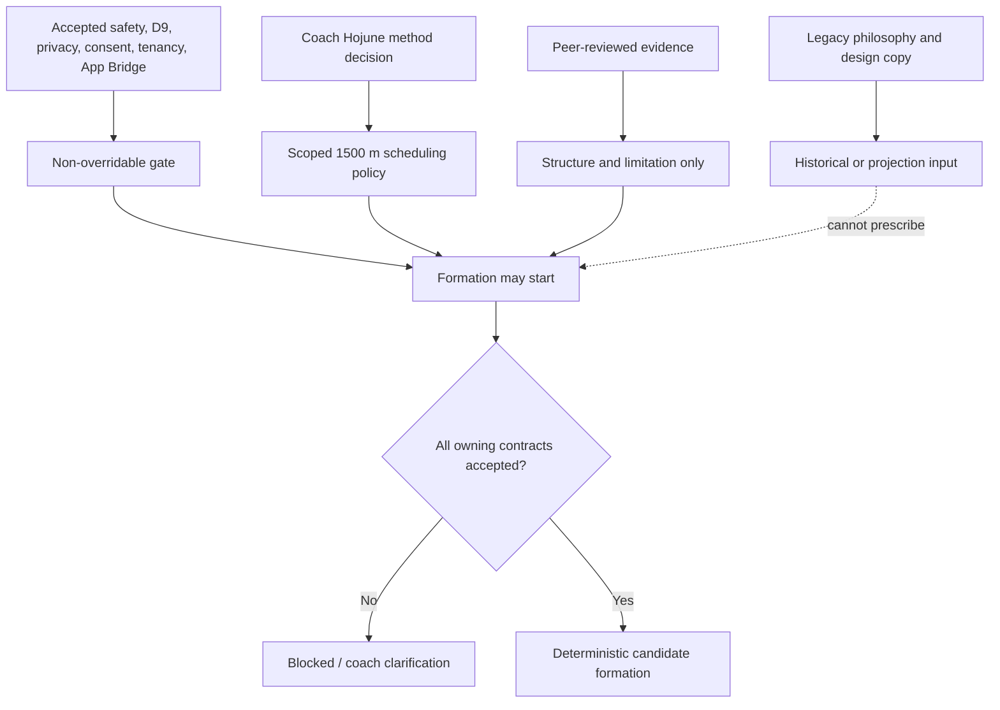
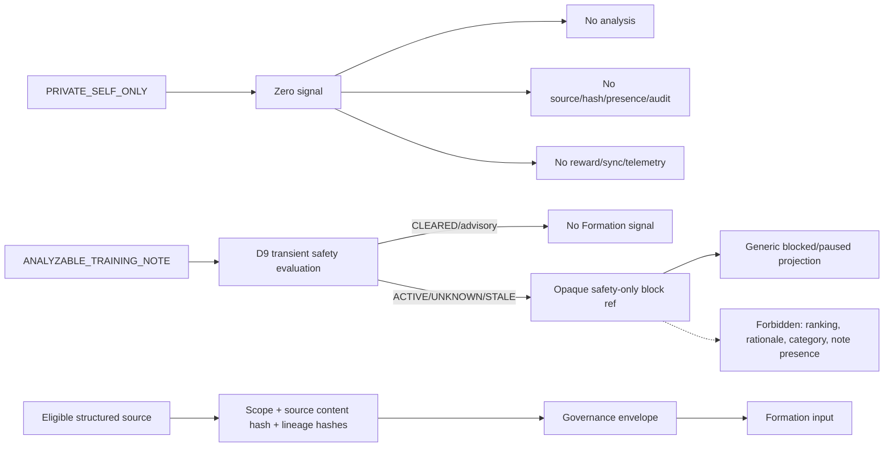
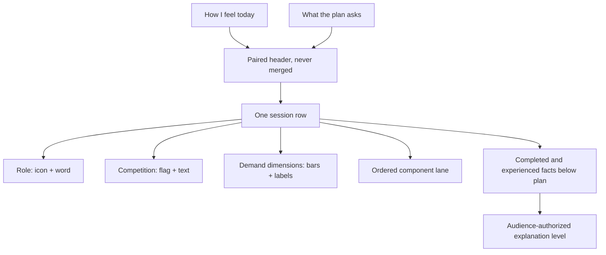
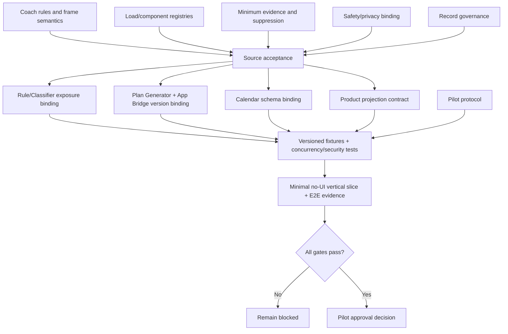

# TRAINING_PLAN_BLUEPRINT_MULTIPERSPECTIVE_REVIEW.md

```yaml
review_metadata:
  review_id: TO-REVIEW-FORMATION-MULTIPERSPECTIVE-2026-07-14-001
  reviewed_commit: 807380c
  reviewed_pr: 63
  review_round: RT2_MULTIPERSPECTIVE_REVIEW
  persona_reviews_total: 9
  initial_acceptance_passes: 0
  initial_acceptance_fails: 9
  resulting_open_issues: 11
  resulting_canonical_blockers: 10
  resulting_contract_vectors: 96
  artifact_status: REVIEW_RECORD_NOT_ACCEPTANCE
  implementation_authority: false
  app_changes_authorized: false
```

---

## 1. Executive Verdict

PR #63의 Formation/Adaptation 문서는 **경계를 정직하게 밝힌 좋은 초안**이다.
그러나 9개 독립 관점 모두가 현재 형태를 승인·구현 가능한 계약으로 보지 않았다.

검토 결과는 초안을 폐기하라는 뜻이 아니다. 반대로 초안이 충분히 구체적이어서
서로 다른 전문가가 같은 지점에서 실제 모순을 찾아냈다는 뜻이다. 이번 보강은
그 모순을 숨기지 않고 10개의 canonical blocker와 96개의 미래 계약 벡터로
전환했다.

현재 권고는 다음과 같다.

1. PR #63은 `DRAFT_FOR_REVIEW` 청사진과 검토 기록으로만 유지한다.
2. Formation, Plan Generator, Calendar, App Bridge 구현은 시작하지 않는다.
3. 코치·안전·개인정보·제품 투영 결정을 먼저 확정한다.
4. 그 뒤 각 owning target을 recount/patch하고 실제 fixture와 동시성 테스트를 만든다.
5. `app/`은 Fable 소유 경계로 유지한다.

---

## 2. Nine-Persona Review

| Persona | Initial verdict | 가장 중요한 발견 | 반영 위치 |
|---|---|---|---|
| 1500 m coach | FAIL | 경기 노출이 D1/D2에서 사라질 수 있고, missed MAIN catch-up과 re-anchor carry-over가 비어 있음 | exposure ledger, no-catch-up, re-anchor blocker |
| Sport scientist | FAIL | 8개 중 primary empirical은 1개뿐이며, 9.5일·2-3 MAIN·간격은 근거가 검증한 값이 아님 | evidence-type audit, pilot limits |
| Athlete/coach UX | FAIL | 연결 코치 권한, 피로 우선 보기, 복합 훈련, 5단계 설명, 접근성 계약이 없음 | product projection blocker |
| Privacy/guardian | FAIL | note-derived CLEARED 경로, 상세 D9 reason, guardian revoke race, retention 공백 | opaque block, grant epoch, governance blocker |
| Distributed systems | FAIL | selection/revoke race, hold stream, version lifecycle, idempotency, hash preimage, atomicity가 불완전 | shared aggregate, event stream, lifecycle, hash envelope |
| Formal methods | FAIL | Conservative fallback 모순, partial sort, DST re-anchor, idempotency 순서가 비결정적 | mandatory conservative, total comparator, resolved boundary |
| Product architect | FAIL | 안전보다 method decision이 앞섰고, 미승인 제안을 automated invariant로 표시함 | authority reorder, proposed authority class |
| Implementation readiness | FAIL | Plan Generator/App Bridge/Safety Gate/Calendar가 필요한 레코드와 트랜잭션을 표현하지 못함 | downstream target requirements |
| N-of-1 statistician | FAIL | suppressed counts/history leak, stale outcome, Physio source 조기 사용, 파일럿의 과도한 안전 주장 | zero-output suppression, typed context, feasibility-only pilot |

`FAIL`은 초안의 존재 가치가 아니라 **acceptance/execution readiness**에 대한 판정이다.

---

## 3. Authority Blueprint



### Confirmed

- one coach-linked 1500 m athlete
- athlete-local civil 9.5-day frame
- 2 or 3 planned MAIN exposure events
- approximately three days as a placement tendency, never readiness clearance
- multimodal/composite work remains visible
- 2 or 3 deterministic and meaningfully different candidates
- linked human coach makes the final scoped selection
- `PRIVATE_SELF_ONLY` is zero-signal and never analyzed

### Proposed

- exact MAIN exposure-class vocabulary
- `BALANCED`, `CONSERVATIVE`, `COMPETITION_PREP`, `RECOVERY_FOCUSED` taxonomy
- arbitration and transformation registry
- component, measure, load-vector, and hash schemas
- frame-head, hold-stream, plan-version, validation, adaptation, CAS, and idempotency records
- five-level product projection

### Held

- exact phase placement, race/taper/progression/recovery rules
- every-sliding-window versus named-frame exposure accounting
- re-anchor carry-over and missed-MAIN rescheduling
- longitudinal thresholds and Physio Source Trust use
- component aggregation and multidimensional feasibility mappings
- pilot protocol and target bindings

### Runtime

- Formation runtime: none
- Formation executed tests: zero
- D9 evaluator evidence: real but not Formation evidence
- current D9/RVE note-derived `CLEARED` behavior: proposed Formation privacy boundary와 충돌

---

## 4. End-To-End State Model

```mermaid
stateDiagram-v2
    [*] --> Blocked: privacy/auth/safety/context failure
    [*] --> Eligible: all scoped gates pass
    Eligible --> OptionSetComplete: frame + accepted rules + 2/3 distinct options
    OptionSetComplete --> SelectedPendingValidation: linked coach selects atomically
    SelectedPendingValidation --> ValidationRejected: Rule Spec rejects
    SelectedPendingValidation --> ValidatedAccepted: Rule Spec accepts
    ValidatedAccepted --> Held: safety/auth event
    Held --> ValidatedAccepted: explicit fresh release, no active cause
    ValidatedAccepted --> AdaptationProposed: eligible trigger and coach review
    AdaptationProposed --> ValidatedAccepted: reject proposal
    AdaptationProposed --> AdaptationValidation: coach requests accept
    AdaptationValidation --> ValidatedAccepted: Rule validation rejects; current plan remains
    AdaptationValidation --> SuccessorAccepted: validation accepts + atomic CAS
    SuccessorAccepted --> Held: safety/auth event
    ValidationRejected --> [*]
    Blocked --> [*]
```



Key correction: coach selection does not immediately create an executable accepted
plan. It creates `SELECTED_PENDING_VALIDATION`. Only a matching Rule Spec validation
event produces `VALIDATED_ACCEPTED`.

Adaptation acceptance follows the same rule: the exact reviewed proposed content and
exposure ledger receive a fresh, concurrency-safe terminal validation under the
current Rule Spec. Rejection invalidates only that proposal and leaves the current
plan and sibling proposals intact; acceptance and successor creation commit together.
The reserved proposal version ID, validation target ID, and accepted successor ID are
identical and non-reusable. Coach rejection uses separate `REJECT_ADAPTATION`
authorization and cannot validate, execute, supersede, release a hold, or create a version.

Selection, safety revocation, hold activation/release, and adaptation acceptance share
one scoped lifecycle aggregate. This is the linearization point for aggregate revision,
safety epoch, authorization revocation epoch, current version, and active holds.

---

## 5. Privacy And Governance Flow



Every persisted source, authorization, safety, plan, hold, adaptation, selection, and
audit record needs an accepted governance envelope covering audience/access,
retention, youth age-out/deletion, consent revocation, legal hold, key erasure, and
audit minimization.

An athlete/coach surface may say only that the operation is blocked or paused. It may
not reveal that a note existed, the category of a safety concern, evaluator timing,
source hashes, or an audit correlation.

---

## 6. Training Logic Corrections

### Competition

`COMPETITION` remains a Session Classifier label. It counts once as a MAIN exposure in
a separate `MainExposureLedgerRecord`, but it does not receive an unaccepted `RACE`
class automatically. Rule D1/D2 must consume this ledger or remain blocked.

### Mixed sessions

One run + plyometric + strength session remains one event and one exposure. Ordered
typed components and their measures remain visible. A dominant energy-system label
cannot erase the other components.

### Conservative option

`CONSERVATIVE` is candidate 2 and is mandatory for a selectable set. If it is
infeasible, the system stops before contextual candidates. A MAIN move must pass every
accepted intervening metabolic, mechanical, neuromuscular, strength-power,
duration-volume, and competition-stress constraint before maximizing spacing.

### Missed MAIN

A missed MAIN remains a planned fact but is not a completed exposure. It never causes
automatic catch-up, compression, or back-to-back work. Any reschedule needs a new
coach-reviewed class/load/spacing/safety decision.

### Re-anchor

A re-anchor uses resolved local-civil boundaries, a frame-head CAS, one unique
successor, and explicit disposition for displaced sessions. The owner still must
decide sliding-window versus named-lineage-frame count and predecessor carry-over.

---

## 7. Evidence Audit

The original ledger contains eight PubMed-indexed sources, but only Dobbin et al. is
primary empirical research. The remainder are narrative review, consensus, or
systematic review/meta-analysis. They are compatible with preserving multiple
modalities and separating planned, completed, subjective, and external facts. They do
not validate this exact schedule, taxonomy, vector, thresholds, safety, or efficacy.

Useful counterevidence and alternative interpretations:

| Source | What it changes in interpretation |
|---|---|
| [Casado et al., 2021, PMID 33801482](https://pubmed.ncbi.nlm.nih.gov/33801482/) | Twenty elite/world-class milers showed speed- and endurance-adapted response differences; heterogeneity matters. |
| [Ingham et al., 2012, PMID 22634971](https://pubmed.ncbi.nlm.nih.gov/22634971/) | One 1500 m case can show coincidence and feasibility, not causal general proof. |
| [Scantlebury et al., 2018, PMID 29045316](https://pubmed.ncbi.nlm.nih.gov/29045316/) | Coach-athlete RPE differences can be context dependent. |
| [Redkva et al., 2017, PMID 27864571](https://pubmed.ncbi.nlm.nih.gov/27864571/) | Group results can also show no mean difference and only moderate relationship. |
| [Ryan et al., 2023, PMID 36820706](https://pubmed.ncbi.nlm.nih.gov/36820706/) | Strong relationship/equivalence can coexist with bias. |
| [Lum et al., 2023, PMID 35323106](https://pubmed.ncbi.nlm.nih.gov/35323106/) | Small modality trials do not justify a universal plyometric/strength ranking. |
| [Skovgaard et al., 2014, PMID 25190744](https://pubmed.ncbi.nlm.nih.gov/25190744/) | Same-session speed-endurance and strength can be viable in a specific trained sample. |
| [Wilmot et al., 2025, PMID 40845315](https://pubmed.ncbi.nlm.nih.gov/40845315/) | Current female-soccer evidence supports separate internal/external records, not assumed disagreement. |

The 9.5-day frame, 2-3 MAIN count, and approximate spacing remain first-pilot
scheduling conventions from Coach Hojune's experience and longitudinal practice data.
They are not upgraded to scientific facts by owner acceptance.

---

## 8. Athlete And Coach Projection



### Five Explanation Levels

| Level | Audience/use | Content |
|---|---|---|
| 1. Snapshot | Athlete | active/paused, training/race, expected demand, coach-selected state |
| 2. Plain Why | Athlete | goal, why today, what to watch; short and acronym-free |
| 3. Session Breakdown | Athlete/coach | role, ordered components/measures, planned/completed/felt side by side |
| 4. Coach Reasoning | Linked coach | candidate differences, tradeoffs, constraints, uncertainty, safe source labels |
| 5. Technical Trace | Authorized coach/audit | rule/reason codes, versions, source refs, hashes, event/audit state |

Color is secondary only. Energy intent may use color, while modality uses icon/code or
pattern, demand uses bars plus text, completion uses icon plus label, and uncertainty
uses border/icon/text. No color-only, hover-only, red-green good/bad, or dominant-
system collapse is acceptable. Print, grayscale, touch, screen-reader, and
middle-school-language equivalents are required.

---

## 9. Proposed N-Of-1 Pilot

This is a review proposal, not an accepted protocol.

### Sequence

1. Three complete 9.5-day shadow frames: generate and review, but do not let the
   system govern execution.
2. Six assisted frames: linked coach selects only after all target bindings and stop
   criteria are accepted.
3. No automatic demand increase, catch-up MAIN, medical clearance, or injury claim.

### Evaluate

- deterministic repeatability and golden-hash agreement
- missing/context clarification rate
- coach review time, selection rate, override/rebuild reasons
- athlete/coach comprehension of plan state and explanation levels
- planned/completed/experienced data completeness without favorable imputation
- privacy, authorization, safety-hold, and audit contract violations
- prospectively defined adverse/safety events and coach intervention timing

### Proposed success boundary

- zero privacy, cross-scope, stale-authorization, active-hold bypass, or partial-commit
  violations
- every generated set reproducible from its immutable snapshot and rule version
- every execution linked to `VALIDATED_ACCEPTED` and a verified coach selection
- feasibility and decision usefulness only; no claim of safety, efficacy, injury-risk
  reduction, or performance causality

---

## 10. Blocker Roadmap



| Order | Blocker | Decision owner |
|---:|---|---|
| 1 | `OI-FA-COACH-RULESET-001` | Coach Hojune |
| 2 | `OI-FA-LOAD-COMPONENT-001` | Coach + Formation/Plan target owners |
| 3 | `OI-FA-MINIMUM-EVIDENCE-001` | Research + privacy/data owners |
| 4 | `OI-FA-UPSTREAM-SAFETY-PRIVACY-BINDING-001` | D9/RVE/Safety Gate/App Bridge owners |
| 5 | `OI-FA-RECORD-GOVERNANCE-001` | Privacy/security/data governance owners |
| 6 | `OI-FA-RULE-CLASSIFIER-EXPOSURE-BINDING-001` | Rule Spec + Classifier + Plan Generator owners |
| 7 | `OI-FA-PLAN-VERSION-BINDING-001` | Plan Generator + App Bridge + Safety Gate owners |
| 8 | `OI-FA-CALENDAR-SCHEMA-BINDING-001` | Calendar mapping owner |
| 9 | `OI-FA-PRODUCT-PROJECTION-001` | Product/design owner with athlete/coach review |
| 10 | `OI-FA-PILOT-PROTOCOL-001` | Coach + safety/research owner |

`OI-FA-RUNTIME-EVIDENCE-001` follows the ten blockers and is not itself a canonical
source blocker. Runtime work before those decisions would test an invented contract.

---

## 11. Exact Next Work

1. Close `OI-FA-COACH-RULESET-001`: Coach Hojune reviews the race, mixed-session,
   missed-MAIN, heavy-intervening-load, and re-anchor walkthroughs and decides
   named-frame/sliding-window plus predecessor carry-over semantics.
2. Close `OI-FA-LOAD-COMPONENT-001`: accept or revise the class, load/component,
   taxonomy, transform, feasibility, and no-catch-up registries.
3. Close `OI-FA-MINIMUM-EVIDENCE-001`: research and privacy/data owners accept the
   minimum evidence, suppression, missingness, and longitudinal-use policy.
4. Close `OI-FA-UPSTREAM-SAFETY-PRIVACY-BINDING-001`: D9/RVE/Safety Gate/App Bridge
   owners bind opaque note-derived safety, guardian, freshness, and authorization
   semantics without exposing private-note signal.
5. Close `OI-FA-RECORD-GOVERNANCE-001`: privacy/security/data-governance owners
   accept access, retention, youth deletion, revocation, legal-hold, key-erasure, and
   minimization behavior.
6. Conduct one bounded Formation source-acceptance decision. If any of steps 1-5 is
   unresolved, Formation remains proposed and target patches do not start.
7. After bounded acceptance, patch the four owning targets in dependency order:
   Rule/Classifier exposure binding, Plan Generator/App Bridge/Safety Gate version
   binding, Calendar schema binding, and product projection.
8. Close `OI-FA-PILOT-PROTOCOL-001` before fixture execution or a vertical slice:
   accept baseline, monitoring cadence, intervention/adverse-event stops, and success
   criteria without claiming safety or efficacy.
9. Convert the 96 prose vectors into versioned fixtures with fixed clock/tzdb, exact
   JCS preimages/digests, append-only expected records, database barriers, and E2E
   overlays.
10. Run a minimal no-UI vertical slice and the required concurrency, security, and E2E
    evidence. Only then may the owners make a separate pilot-approval decision.

---

## 12. Owner Follow-Up Addendum

This addendum records a decision after the nine-persona review. It does not rewrite
the historical verdict for commit `807380c`.

```yaml
owner_follow_up:
  decision_ref: TO-DEC-ATHLETE-VISIBLE-SHADOW-2026-07-14-001
  pr63_treatment: MERGED_AS_DRAFT_REVIEW_RECORD
  canonical_acceptance: false
  runtime_authority: false
  shadow_operation_must_be_athlete_visible: true
  hidden_shadow_operation: forbidden
  exact_pilot_protocol_accepted: false
  current_formation_contract_vectors_after_addendum: 104
```

The owner accepted an athlete-visible product boundary: the journal owner knows what
is being compared, that the generated candidate does not govern real training, which
structured data categories are used, how progress is shown, and how to stop. Safe
checks, stickers, or milestones may support journaling, but consent, continued
enrollment, training load, speed, favorable reporting, and silence about pain cannot
be reward conditions.

The original nine-persona review produced 96 vectors. Formation version 0.4 adds
`FA-TC-097` through `FA-TC-104` for separate consent, honest notice, no real-plan
mutation, evidence-bound progress, safe rest/pain recognition, private-memo
zero-signal, withdrawal, and accessible projection. These additions narrow the
product boundary but do not close `OI-FA-PILOT-PROTOCOL-001` or any other canonical
blocker.

[REVIEW_RECORDED]
