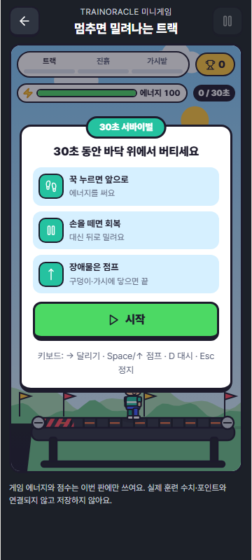
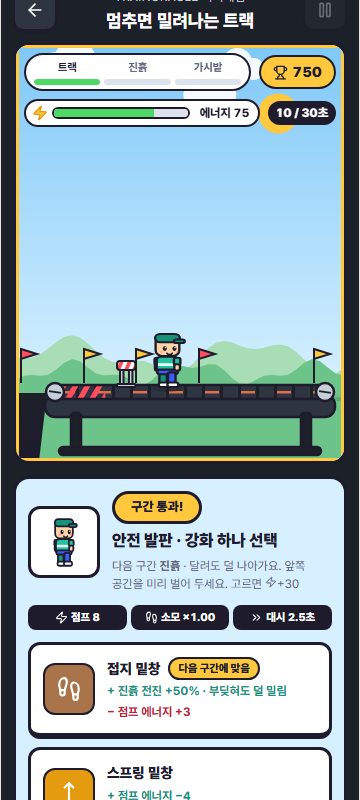

# 3차: 모바일 게임 아트·UI 전면 개편

작성일: 2026-10-07. 오너 요청: "캐릭터나 맵 등 모든 부분을 새롭게, 모바일 게임처럼. 로블록스 느낌이지만 디자인은 요즘 게임 톤, 건히어로 느낌도 조금."
상태: PR #349 후속 커밋 / 플레이테스트 전.

## 디자인 방향

| 참고 | 가져온 것 | 가져오지 않은 것 |
|---|---|---|
| 로블록스 러닝·Obby | 블록형 치비 캐릭터, 구간·체크포인트, 짧은 재도전 | 로블록스 캐릭터·UI·에셋 |
| 요즘 모바일 캐주얼 | 두꺼운 외곽선, 채도 높은 파스텔, 큼직한 눌림 버튼, 리본 배지, 별 3개 결과, 콤보·점수 팝업 | 과금·광고 UI |
| Gun Hero | 위는 작은 전투 무대, 아래는 장비 패널 / 캐릭터 미리보기 + 능력치 줄 + 장비 카드 | Gun Hero 그림·고양이 캐릭터 |

모든 그림은 Canvas 경로로 새로 그렸다. 외부 이미지·폰트·패키지를 추가하지 않았다.

## 앱 디자인 기준과의 관계

앱 기준은 "직각·hairline·절제된 색"이다. 게임 톤과 충돌하므로 `docs/UX_UI_VISUAL_STANDARD.md` **§6A 미니게임 월드**를 추가해 세 번째 세계로 분리했다.

- 색은 `colors_and_type.css`의 `--game-*` 토큰만 쓴다. 캔버스도 CSS 토큰을 읽는다.
- `.treadmill-game` 안에서만 쓴다. 계약 테스트(`visual-system.contract.test.ts`)가 게임 파일 밖의 `--game-*` 사용과 게임 파일 안의 hex를 막는다(결함 주입으로 확인).
- `box-shadow` 금지(A1)와 Pretendard 단일 폰트(A3)는 그대로다. 입체감은 아래쪽 두꺼운 테두리로 표현한다.
- 모션 감소 설정에서는 흔들림·파티클·잔상·패럴랙스·등장 애니메이션을 끄고 같은 정보를 정적으로 보여 준다.

**오너 확인 필요:** §6A는 이번 요청을 바탕으로 작업자가 작성한 기준 개정안이다. 그 문서의 개정 규칙(§9)상 오너 승인이 있어야 확정된다.

## 구성

**캐릭터(`treadmill/sprites.ts`)**: 모자 쓴 블록형 러너. 자세 8종(대기·달리기·점프·추락·피격·지침·환호·대시), 표정 6종, 볼터치, 착지 찌그러짐. 강화를 고르면 겉모습이 바뀐다: 접지 밑창은 주황 징 신발, 스프링 밑창은 발밑 스프링과 높아진 키, 일정한 박자는 금색 헤드밴드와 손목밴드.

**맵(`treadmill/draw.ts`)**: 구간마다 하늘·언덕·소품이 다르다.
- 트랙: 낮 하늘, 구름, 초록 언덕, 깃발
- 진흙: 노을, 갈대, 진흙 웅덩이 벨트
- 가시밭: 밤하늘, 별, 달, 수정 바위

트레드밀은 기계 몸체·다리·롤러·움직이는 판·뒤쪽 빨간 경고 줄무늬로 그렸다. 뒤쪽 끝에는 구덩이가 있어 떨어지는 장면이 보인다. 배경은 앞으로 갈수록 빠르게 움직인다.

**이펙트**: 달리기 먼지, 점프·착지 먼지, 대시 잔상과 바람 선, 피격 시 화면 흔들림·별·"쿵!", 장애물을 넘으면 "+점수 ×콤보" 팝업, 구간 통과 배너, 완주 꽃가루, 추락 시 회전하며 떨어짐, "!" 예고 말풍선, 점프 타이밍 금색 띠와 지금 뛰면 되는 장애물의 금색 테두리.

**화면**: 어두운 게임 프레임, 둥근 무대. 무대 위에 떠 있는 정보:
- 구간 진행 알약
- 점수 배지
- 에너지 바
- 시간
- 콤보 배지
- 하단 상황 알림

시작·일시정지·결과는 무대 위에 리본이 달린 카드로 띄운다. 조작 버튼 세 개(초록 달리기, 노랑 점프, 하늘색 대시)는 누르면 실제로 눌려 들어간다. 구간 사이 강화 화면은 Gun Hero처럼 캐릭터 미리보기 + 능력치 줄 + 아이콘 장비 카드(Lv 표시, 다음 구간에 맞음 배지)로 구성했다.

**규칙 추가(`treadmill.ts`)**:
- 시작할 때 3초, 다시 이어 할 때 1초 카운트다운. 그동안 바닥이 멈춰 있고 점프·대시는 받지 않는다.
- 점수: 장애물 하나에 100점. 콤보 1회마다 50점씩 더하고 최대 5회까지 쌓인다. 구간을 통과하면 300점. 부딪히면 콤보가 초기화된다.
- 완주 별: 부딪힘 0번이면 3개, 1번이면 2개, 그 이상이면 1개.
- 이번 접속 최고 점수: 메모리에만 두고 저장·전송하지 않는다.

## 검증

| 항목 | 결과 |
|---|---|
| 앱 TypeScript | 통과 |
| 엔진 테스트 | 19/19 (카운트다운, 점수·콤보·별 테스트 추가) |
| 셸·홈·탭·시각 계약 | 41개 중 40개 통과. 실패 1개는 기존 Trends 불일치 |
| e2e 타입 | 기존 오류 2개 외 새 오류 없음 |
| 실제 브라우저 | 6/6 (데스크톱·모바일) |
| 결함 주입 | 5/5 감지: 카운트다운 무시, 콤보 미초기화, 별 기준 완화, 게임 파일의 hex, 다른 화면의 `--game-*` 사용 |
| 빌드 | Node 24.19.0 통과. 게임 청크 JS 39.05 kB / gzip 13.41 kB, CSS 16.89 kB |

결함 주입 중 새 계약 테스트의 정규식에 `\b`가 백스페이스 문자로 들어가 hex를 잡지 못하는 것을 발견해 고쳤다. 고친 뒤에는 결함을 넣으면 실패하고 되돌리면 통과한다.

## 화면

| 시작 | 강화 | 완주 |
|---|---|---|
|  |  |  |

## 남은 일

- 오너의 §6A 승인
- 실제 휴대폰에서 동시 터치와 프레임 속도 확인
- 효과음·배경음 (오디오 정책 필요)
- 캐릭터 꾸미기는 영구 육성 제외 원칙과 충돌하지 않는 범위에서 별도 결정
