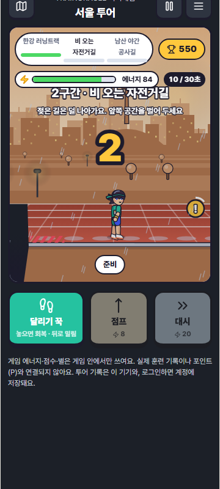

# 6차: 한 판 흐름 · 애니메이션 러너 · 앱 전체 오픈소스 고지 · 보상/광고 설계

작성일: 2026-10-09.

오너 요청:
- "게임 한 턴을 끝내고 넘어가는 플로우가 어색하다."
- "게임 안 고지만 해도 괜찮은지 봐."
- "현금성 포인트까지 고려한 안전한 포인트와 광고 구간·보상을 생각해 봐. 토스 미니게임이 이상적이다."
- "캐릭터를 러닝에 맞는 일본 애니메이션 스타일로 재구성해."

## 1. 한 판 흐름: 무엇이 어색했나 → 무엇을 바꿨나

실제 폰 화면(360px)으로 서울을 처음부터 끝까지 캡처해 확인했다.

| # | 어색했던 점 | 바꾼 것 |
|---|---|---|
| 1 | 구간을 통과하면 경기 화면 **아래에** 강화 패널이 나타나 화면이 길게 밀렸다. 고를 카드가 화면 밖에 있었다 | 강화 카드를 **경기 화면 위**에 띄운다(구간 통과 리본 + "다음: 구간 이름·힌트" + 강화 3개). 조작 버튼은 자리를 지킨 채 흐려져서 화면이 덜컹이지 않는다 |
| 2 | 강화를 고르면 "2구간 / 계속 / 처음부터" 카드가 한 번 더 떴다. 탭이 2번 필요했고, "처음부터"가 바로 옆에 있어 잘못 누르기 쉬웠다 | **고르면 바로 출발**한다. 바닥이 멈춘 2초 카운트다운 동안 "2구간 · 비 오는 자전거길"과 힌트를 크게 보여준다 |
| 3 | 카운트다운 위에 "구간 통과!" 글자가 겹쳤다 | 구간이 바뀌면 지운다(5차에서 고침) |
| 4 | 결과 카드에 굵은 버튼이 3개(다음 도시·다시·지도) 있었다. 기록 표와 팁이 한꺼번에 보여 길었다 | **굵은 버튼 1개**만 둔다: 완주면 "다음 도시 · 대전", 실패면 "다시 도전". 나머지는 얇은 글자 버튼(처음부터·지도)이고, 기록 표는 "이번 판 기록 ▾"으로 접는다 |
| 5 | 2·3구간에서 실패하면 30초 전체를 다시 해야 해서 맥이 빠졌다 | **"N구간부터 다시"**: 강화·에너지·점수를 그 구간 시작 시점 그대로 이어서 한다. 대신 그 판은 별이 최대 1개다(남용 방지, 화면에 고지). 1구간 실패는 원래대로 "다시 도전"이다 |
| 6 | 도시마다 규칙 3줄과 키보드 안내가 매번 나왔다 | 처음 완주하기 전까지만 규칙 카드를 보여준다. 그 뒤에는 첫 구간 힌트와 그 도시 최고 점수 한 줄로 줄인다 |
| 7 | 일시정지 카드에 "계속"과 "처음부터"가 같은 크기였다 | "계속"만 굵게 두고, "처음부터·지도로"는 작은 글자 버튼으로 바꿨다 |

탭 수 기준(서울 1판): 이전에는 시작 1 + 구간마다 2 + 결과 1이었다. 지금은 시작 1 + 구간마다 1 + 결과 1이다.

| 강화 고르고 바로 출발 | 구간 소개 카운트다운 | 구간부터 다시 | 완주 → 다음 도시 |
|---|---|---|---|
|  |  |  |  |

## 2. 캐릭터: 애니메이션 러너로 다시 그림

외부 그림을 가져오지 않고 코드로 새로 그렸다(`screens/treadmill/anime-runner.ts`). 6명 모두 같은 뼈대를 쓴다. 키와 판정은 그대로이고 모습만 다르다.

| 요소 | 내용 |
|---|---|
| 비율 | 덩어리 치비(2등신) 대신 스포츠 애니메이션 비율(약 3.6등신). 긴 다리가 속도감을 준다 |
| 달리기 동작 | 허벅지와 정강이를 따로 움직이는 2관절 다리: 무릎 들어 올리기 → 착지 → 뒤꿈치 차올리기. 팔은 90°로 굽혀 반대로 흔든다. 대시는 동작을 더 크게, 더 숙여서 |
| 얼굴 | 큰 눈(흰자·눈동자·색 띠·하이라이트 2개·굵은 윗속눈썹), 달릴 때 집중한 눈매와 눈썹, 볼 빗금 홍조 |
| 머리 | 앞머리 뾰족 실루엣이 속도에 따라 뒤로 흐르고, 머리카락 광택 고리를 넣었다. 하나는 포니테일이 뒤로 날린다. 토리는 머리띠 끈이 뒤로 휘날린다 |
| 음영 | 그라데이션 없이 단색 그림자 한 단계(셀 셰이딩)와 얇은 진한 외곽선 |
| 소품 | 레이스 번호표, 싱글렛, 러닝화. 대시에는 속도선, 지친 상태에는 땀방울, 부딪힘에는 놀람 선, 완주에는 반짝이 |
| 강화 표시 | 접지 밑창(신발 색과 징), 스프링(발밑 용수철), 일정한 박자(손목·머리 밴드)가 몸에 그대로 보인다 |

| 밤 구간 | 부산 + WebGPU |
|---|---|
|  |  |

## 3. 오픈소스 고지: 게임 안 고지만으로는 **부족했다**

점검 결과:
- 앱 번들에는 패키지 23개가 들어간다(react, react-dom, scheduler, zod, @supabase 7개, @use-gesture 2개, lucide-react, tslib, shaders 쪽 5개 등).
- 그런데 사용자가 볼 수 있는 고지는 게임 메뉴의 7개뿐이었다. 더보기의 "스티커·오픈소스 출처"에는 스티커 그림만 있고 소프트웨어는 0개였다.
- 게임 메뉴의 "앱 전체 고지는 더보기에서" 안내는 사실과 달랐다.
- MIT·ISC·BSD·Apache는 배포할 때 저작권과 허가 문구를 함께 실어야 한다.

고친 것:
- `app/scripts/generate-third-party-notices.mjs`를 만들었다. `package-lock.json`에서 운영 의존성 트리를 직접 읽는다(개발 도구는 제외). 각 패키지의 `LICENSE`/`NOTICE` 전문과 Pretendard OFL을 묶어 `public/legal/third-party-notices.html`을 생성한다.
- **더보기 › 오픈소스 소프트웨어 고지**와 게임 메뉴 › 오픈소스에서 이 문서로 연결한다.
- 계약 테스트 `src/legal/third-party-notices.contract.test.ts`를 추가했다.
  - 의존성을 추가·삭제·업그레이드하고 다시 생성하지 않으면 `npm test`가 실패한다.
  - 허용 라이선스는 MIT/ISC/0BSD/BSD/Apache-2.0이다. 이 밖의 라이선스가 들어오면 실패한다.
  - 전문이 없는 패키지가 있으면 실패한다.
- 23개 모두 라이선스 파일이 있었다. Apache-2.0(`tsover-runtime`)에는 NOTICE 파일이 없어서 전할 NOTICE는 없다.

## 4. 포인트·광고

설계 문서 [REWARDS_ADS_PLAN.md](REWARDS_ADS_PLAN.md)를 따로 작성했다. 요지는 다음과 같다.
- 토스·카카오페이 보상은 **광고주가 비용을 내고, 선불업자로 등록된 플랫폼이 포인트를 발행하는** 구조다. 보상 대상은 걸음·보기·참여이고, 게임 결과에는 주지 않는다.
- TrainOracle은 게임 결과를 현금성 보상과 영구히 분리한다. 게임에는 **메달**(앱 안에서만 쓰고 현금 교환 불가, 결과와 무관하게 고정, 하루 상한)을 둔다. 현금성은 나중에 앱인토스 프로모션 등으로, 비게임 행동에만 준다.
- 광고 자리는 결과 카드의 선택형 리워드(메달 +2, 하루 3회)와 도시 사이 전면 광고(처음 3판 제외, 3판에 1회, 3분 간격)다. 14세 이상과 광고 동의가 있을 때만 보여준다. **경기 중·구간 사이·강화 선택 중에는 절대 넣지 않는다.**
- 구현한 것은 규칙 모듈 `domain/minigame/rewards.ts`와 테스트뿐이다. 광고 SDK와 네트워크 요청은 없다(`NO_ADS` 기본값). 메달 화면도 아직 없다.

## 검증

| 항목 | 결과 |
|---|---|
| TypeScript | 통과 |
| 미니게임·렌더러·고지·더보기·계정 미니게임·스타일 계약 | 87개 중 86개 통과. 실패 1개는 기존 Trends 불일치다 |
| 엔진 새 테스트 | 강화 선택 → 바로 출발(카운트다운 중 바닥 정지, 체크포인트 저장). 구간부터 다시: 강화·에너지·점수 유지, 별 1개 상한, 1구간·완주 후에는 불가, 처음부터 하면 초기화 |
| 보상 규칙 테스트 | 결과와 무관한 고정 지급, 하루 상한, 리워드 횟수 상한, 14세·동의 차단, 유예·빈도, 광고 없음 기본값, 포인트·보상 모듈과 분리, 변환 함수 없음 |
| 브라우저 | 12/12(데스크톱·폰): 기존 시나리오 + 구간부터 다시 시나리오. 실제 키로 2구간에서 떨어진 뒤 "2구간부터 다시"를 누르면 같은 강화로 10초 지점부터 재개된다 |
| WebGPU | 1/1 |
| 결함 주입 | 새 8/8 감지(별 상한 제거, 1구간 재시도 허용, 출발 카운트다운 제거, 메달에 점수 입력 추가, 하루 상한 제거, 연령 조건 제거, 광고 유예 제거, 고지 전이 의존성 누락). "광고 유예 제거"는 처음에 테스트가 잡지 못해 0판 경우를 추가했다. 기존 9/9도 여전히 감지 |
| 빌드 | 통과. 게임 청크 JS 101.5 kB / gzip 33.4 kB, CSS 34.4 kB. `legal/third-party-notices.html`이 빌드 결과물에 포함된다 |

## 오너 확인이 필요한 것

- "구간부터 다시"의 별 1개 상한이 적당한지(0개로 할지, 2개까지 허용할지)
- 메달 사용처(캐릭터 색·트랙 꾸미기 / 무료 이어하기)와 메달 화면을 만들지
- [REWARDS_ADS_PLAN.md](REWARDS_ADS_PLAN.md) §6의 결정 7개: 배포 채널, 등급분류, P 현금화 방식, 연령 기준, 광고 네트워크, 약관·방침 개정, 세무
