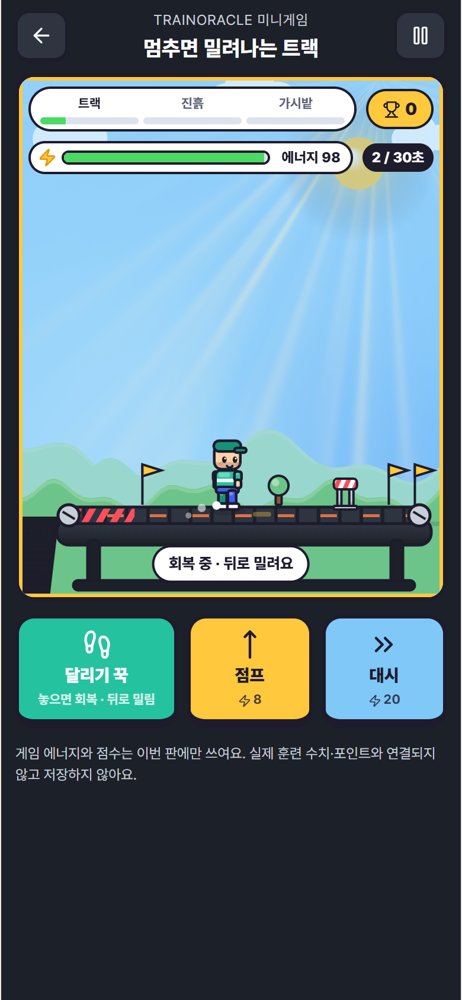
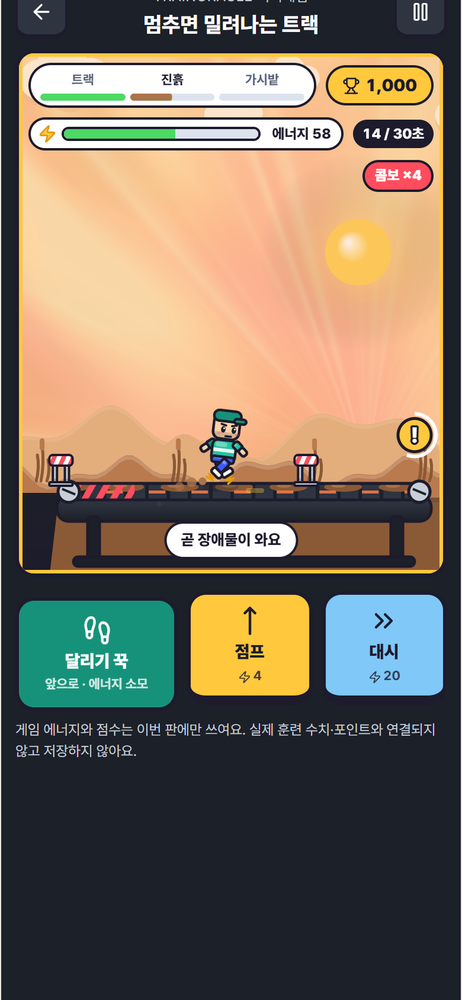
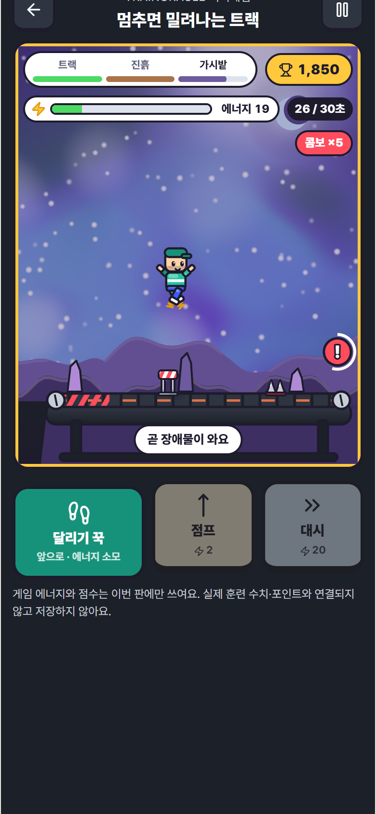
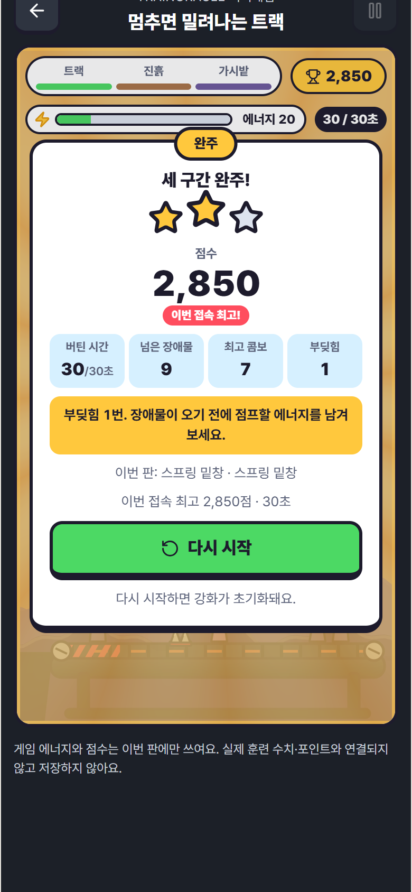

# 4차: shaders 오픈소스로 배경·연출 고도화

작성일: 2026-10-08. 오너 요청: "에셋이 너무 기본적이야. https://shaders.com/updates/shaders-is-open-source 여기서 맘에 드는 걸 찾아서 개선하거나 에셋을 따오자."
상태: PR #349 후속 커밋 / 플레이테스트 전.

## 무엇을 가져왔나

[shaders](https://github.com/shader-effects-inc/shaders) `4.0.2` (npm `shaders`, **MIT**)의 WebGPU 컴포넌트를 구간 하늘과 결과 배경으로 사용한다. 그림 파일을 복사해 오지 않았다. 패키지의 컴포넌트를 조합한 설정만 우리 코드(`sky-presets.ts`)에 있다.

| 장면 | 레이어 |
|---|---|
| 트랙(낮) | LinearGradient + MeshGradient(흐르는 하늘) + Godrays(햇살) |
| 진흙(노을) | LinearGradient + FlowingGradient + Godrays(낮은 해) |
| 가시밭(밤) | LinearGradient + Nebula(성운) + Aurora(오로라) + FloatingParticles(반짝이는 별) |
| 완주 | SunBurst(회전하는 햇살) |
| 실패 | RadialGradient(가라앉는 배경) |

shaders.com의 **Pro 프리셋·섹션은 쓰지 않았다.** 그것은 MIT가 아니라 별도 Content License 대상이다. 오픈소스 패키지의 컴포넌트만 직접 조합했다.

함께 개선한 2D 아트:
- 모든 캐릭터·장애물 부위에 툰 셰이딩(위 하이라이트, 아래 그림자 띠)
- 해에 광륜(halo)과 그라데이션
- 그림자가 있는 뭉게구름
- 언덕 3겹과 윤곽 빛
- 트랙 구간의 나무
- 금속 광택 트레드밀 몸체

## 안전장치

| 위험 | 대응 | 검증 |
|---|---|---|
| 패키지 텔레메트리(`shaders.com/api/telemetry`, 세션 1~5%) | 모든 `createShader` 호출에 `disableTelemetry: true` | 단위 테스트가 호출 수와 옵션 수를 대조. 실제 Chrome+WebGPU e2e에서 6초(텔레메트리 수집 창 5초 이상) 동안 외부 요청 0건 |
| 번들 크기 | `shaders/js`를 동적 import. WebGPU 어댑터가 실제로 있을 때만 받음. 라이브러리 청크 약 2.6 MB / gzip 723 kB는 게임을 연 WebGPU 기기에서만 내려받음 | 빌드 결과: 진입 HTML·modulepreload에 없음. e2e: WebGPU 없는 브라우저는 라이브러리 스크립트 요청 0건 |
| WebGPU 미지원 기기(구형 iOS 등) | 기본 경로는 기존 2D 하늘. 셰이더가 실패하거나 GPU를 잃으면 자동으로 2D로 되돌아감 | e2e: 대체 경로에서 캔버스 픽셀이 불투명한지(하늘이 실제로 칠해졌는지) 확인 |
| 다른 화면으로 번짐 | `shaders` 패키지는 `shader-sky.ts` 한 파일만 import | 단위 테스트가 src 전체 검사 |
| 색 기준 | 셰이더 색도 `--game-fx-*` 토큰에서만 읽음 | 프리셋 테스트: 모든 색이 토큰 값인지 확인. 기존 게임 hex 금지 검사도 대상 파일에 추가 |
| 모션 감소 | 모든 speed·twinkle을 0으로 해서 정지 그림으로 표시. 설정을 바꾸면 즉시 다시 만듦 | 프리셋 테스트 |
| 배터리 | 일시정지·강화 선택 중에는 셰이더 정지. 게임을 나가면 destroy | 코드 검토 |

라이선스 원문은 `app/public/licenses/shaders-MIT.txt`. `public/legal/open-source.html`은 꾸미기 컬렉션 레지스트리에서 자동 생성되는 문서라 손으로 고치지 않았다. **앱 내 오픈소스 고지에 소프트웨어 항목을 넣을 방법(생성기 확장)은 오너 판단이 필요하다.** MIT는 사본에 저작권·허가 고지를 포함하라고 요구하며, 배포 번들에는 라이선스 주석이 남는다.

## 검증

| 항목 | 결과 |
|---|---|
| 앱 TypeScript | 통과 |
| 미니게임·셰이더 단위 | 엔진 19 + 셰이더 프리셋·경계 7 |
| 셸·홈·스타일 계약 | 53개 중 52개 통과. 실패 1개는 기존 Trends 불일치 |
| 전체 Vitest | 기준 코드 90개 실패 / 이번 85개 실패. 이번에만 실패한 6개는 개별 실행 시 77/77 통과. 부하에 따른 시간 초과로 판단(기준 코드 실행에서도 시간 초과 31건) |
| 브라우저(WebGPU 없음) | 6/6 |
| 브라우저(실제 Chrome + WebGPU) | 1/1. `npm run test:e2e:treadmill:webgpu`. 어댑터가 없으면 스스로 건너뜀 |
| 결함 주입 | 6/6 감지: 재생성 시 텔레메트리 켜짐, 모션 감소 무시, 프리셋에 원시 색, 다른 화면으로 패키지 유출, 대체 하늘 생략 |
| 빌드 | 통과. 게임 청크 45.49 kB / gzip 15.57 kB. 셰이더 라이브러리는 별도 지연 청크 |

결함 주입 첫 시도에서 "대체 하늘 생략"이 잡히지 않았다. 그래서 캔버스 픽셀을 검사하는 단언을 e2e에 추가했고, 추가한 뒤에는 감지된다.

## 화면 (실제 Chrome, WebGPU)

| 트랙 | 진흙 | 가시밭 | 완주 |
|---|---|---|---|
|  |  |  |  |

## 남은 일

- 앱 내 오픈소스 고지에 소프트웨어 항목 추가(생성기 범위 결정)
- 실제 휴대폰에서 셰이더 사용 시 프레임·발열 측정. 느리면 레이어 수나 해상도를 줄이는 설정 추가
- iOS Safari의 WebGPU 지원 확인. 지원하지 않으면 2D 하늘 경로로 동작함
