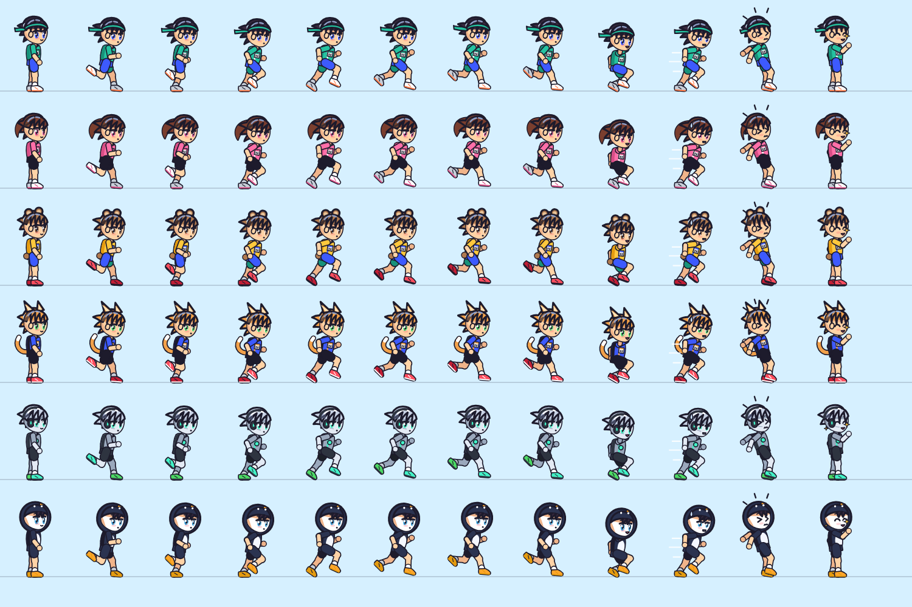
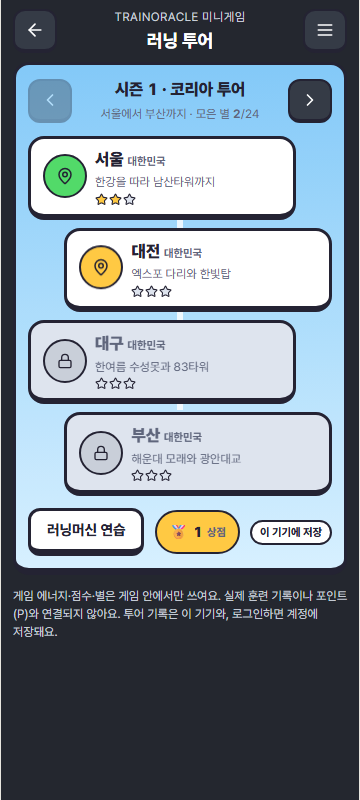
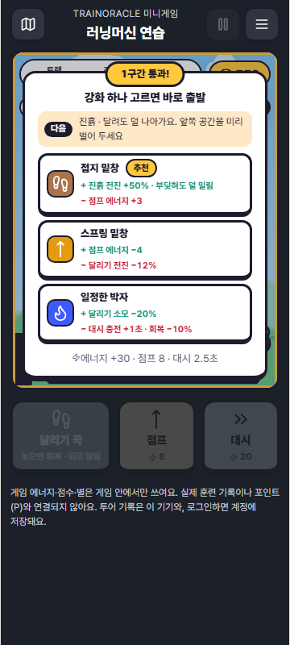
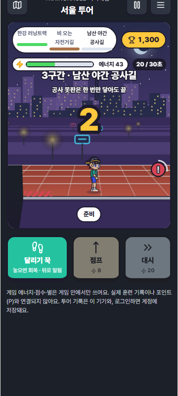
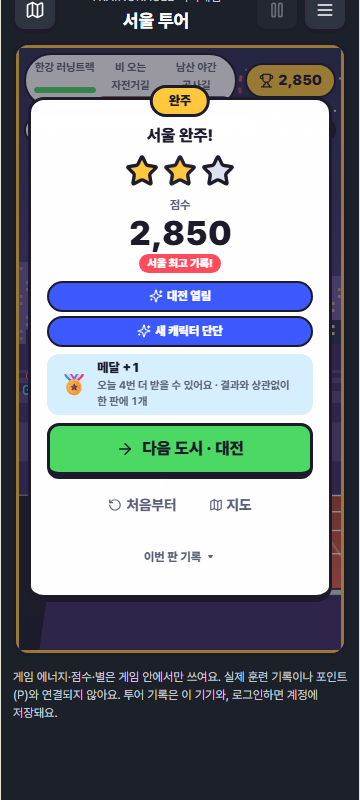
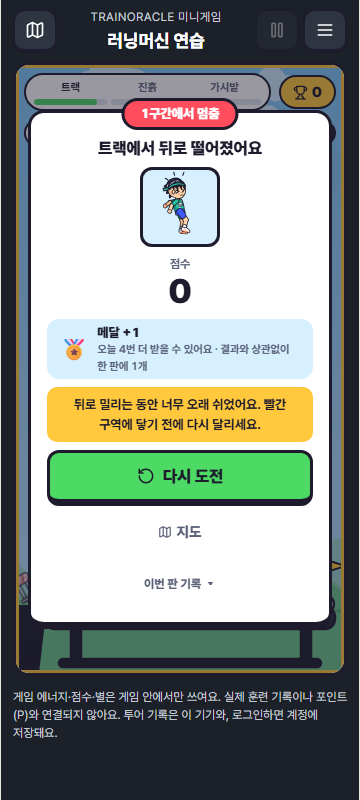
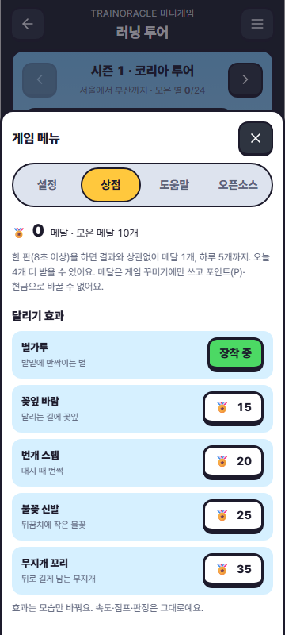
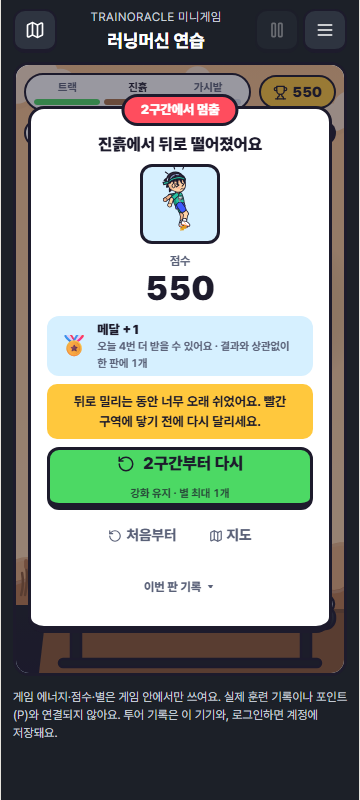
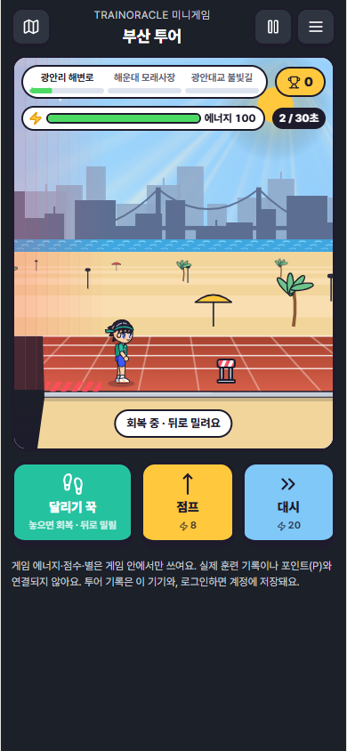

# 러닝 투어 1차 개발 마무리 (2026-10-09)

오너 승인: "추천안대로 진행해, 1차 게임 개발 마무리하자"(2026-10-09). 캐릭터는 "제대로 만들거나 레퍼런스 제대로 가져와".

상태: PR #349 브랜치. **병합과 운영 배포는 하지 않았다.** 서버 마이그레이션 0064도 배포하지 않았다.

## 1차에 들어간 것

| 영역 | 내용 | 문서 |
|---|---|---|
| 게임 규칙 | 30초·3구간 서바이벌, 달리기/쉬기/점프/대시, 강화 3종(이점과 비용), 점수·콤보·별 | UX_PASS_2 |
| 세계관 | 러닝 투어 시즌 1(서울·대전·대구·부산), 시즌 2(도쿄·오사카·파리·런던). 도시를 완주하면 다음 도시가 열리고, 도시가 뒤로 갈수록 어려워진다 | TOUR_PASS_5 |
| 화면 | 2.5D 도시 트랙, 랜드마크 실루엣, 날씨, 야경. WebGPU 하늘(지원 기기) | FX_PASS_4, TOUR_PASS_5 |
| 흐름 | 강화 고르면 바로 출발, 구간 소개 카운트다운, 굵은 버튼 하나뿐인 결과 카드, 구간부터 다시(별 최대 1개) | FLOW_ANIME_PASS_6 |
| 캐릭터 | SD 애니메이션 러너 6종. **Muybridge Plate 65 사진에서 관절 각도를 키 프레임으로 잡은** 14키 달리기 동작 | 아래 §캐릭터 |
| 메달 🏅 | 결과와 상관없이 한 판에 1개(8초 이상), 하루 5개까지. 상점의 달리기 효과 5종(외형만)에 쓴다. P·현금으로 바꿀 수 없다 | REWARDS_ADS_PLAN |
| 광고 | 자리와 규칙만 있다(결과 카드 선택형 리워드, 도시 사이 전면). 광고 네트워크가 없어 화면에 나타나지 않는다(`NO_ADS`, 연령·동의 미확인) | REWARDS_ADS_PLAN |
| 저장 | 이 기기와 계정 문서 `MINIGAME_PROGRESS`(별·점수·캐릭터·설정·메달). 기기 간 자동 병합, 서버는 줄어드는 갱신을 거부한다 | TOUR_PASS_5 |
| 메뉴 | 설정, 상점, 도움말, 오픈소스 | |
| 고지 | 게임 안 고지와 **앱 전체 오픈소스 소프트웨어 고지**(패키지 목록에서 자동 생성) | FLOW_ANIME_PASS_6 |

## 캐릭터: 무엇을 참고했고 어떻게 만들었나

- **동작 참고**: Eadweard Muybridge, *Animal Locomotion* (1887) Plate 65 "Running full speed". Wikimedia Commons 표기는 퍼블릭 도메인(Public Domain Mark 1.0)이다.
  - https://commons.wikimedia.org/wiki/File:Animal_locomotion._Plate_65_(Boston_Public_Library).jpg
  - 윗줄 옆모습 8장 중 1~7번의 허벅지·무릎·발목 각도를 손으로 읽어 키로 잡았다(8번은 1번과 같은 자세). 반대 다리로 대칭 반복해 14키를 만들었다: 착지 → 지지(몸이 가장 낮음) → 차고 나가기 → 공중 → 다리 뻗기.
  - 사진 픽셀은 옮기지 않았다. 원본은 저장소에 넣지 않았다(나체 사진이므로 로컬에서만 참고).
- **비율**: 64~80px 스프라이트에서 표정과 다리 동작이 모두 보이도록 SD 약 2.9등신. 일반 애니메이션은 7~8등신, SD는 머리가 키의 1/3 안팎이다(Wikipedia "Super deformed").
- **스타일**: 3/4 각도 얼굴, 얼굴 아래쪽의 큰 눈(흰자·두 톤 눈동자·하이라이트 2개·굵은 윗속눈썹), 뭉치로 나뉜 앞머리가 속도에 따라 뒤로 흐름, 머리 광택 고리, 단색 그림자 한 단계(먼 쪽 팔다리는 한 톤 어둡게), 얇은 진한 외곽선.
- **검토했지만 쓰지 않은 에셋**:
  - Kenney Toon Characters(CC0): 서양 카툰풍이고 달리기가 3프레임뿐이다.
  - OpenGameArt "2D Chibi Ninja"(CC0): 캐릭터가 1명이고 닌자다.
  - 애니메이션풍 러너 스프라이트 세트 중 CC0/CC-BY인 것은 찾지 못했다.
  - AI 생성 이미지는 쓰지 않았다.
- 게임 메뉴 › 오픈소스에 동작 참고 출처를 적었다.

| 투어 지도 | 강화 고르고 출발 | 밤 구간 | 완주 → 다음 도시 |
|---|---|---|---|
|  |  |  |  |

| 실패해도 메달 +1 | 메달 상점 | 구간부터 다시 | 부산 + WebGPU |
|---|---|---|---|
|  |  |  |  |

## 메달 설계 요점 (승인된 추천안)

- 받는 함수의 입력은 기록·플레이 시간·시계뿐이다. 점수·별·완주·도시는 **입력으로 들어가지도 않는다**(테스트로 고정).
- 날짜별 횟수만 저장한다. 두 기기를 합칠 때는 같은 날의 횟수 중 큰 값을 쓰므로 하루 상한을 넘겨 만들어질 수 없다. 지난 달은 월 합계로 접는다.
- 잔액 = 모은 메달 − 산 효과 가격. 두 기기가 오프라인에서 같은 메달을 각각 썼다면 잔액은 0에서 멈추고, 산 효과는 둘 다 남는다.
- 서버 검증기는 하루 상한을 넘는 기록, 모은 메달이 줄어드는 갱신, 산 효과가 사라지는 갱신을 거부한다.
- P·포인트·보상·꾸미기 모듈은 게임 결과나 메달을 import하지 않는다. 변환 함수도 없다(테스트).

## 검증

| 항목 | 결과 |
|---|---|
| TypeScript | 통과 |
| 전체 Vitest | 7,556개 중 69개 실패. 기준 코드도 85~90개가 부하로 실패하는 분포이고, 게임 관련 실패는 기존 Trends 불일치 1개뿐이다 |
| 미니게임·고지·계정·스타일 계약 | 통과(Trends 1개 제외) |
| 게이트웨이 핸들러 | 86/86(메달 서버 검증 테스트 추가) |
| PostgreSQL(PGlite) 0064 | 통과(5차) |
| 브라우저 | 14/14(데스크톱·폰): 투어, 메뉴, 구간부터 다시, 메달·상점 |
| WebGPU | 1/1 |
| 결함 주입 | 26/26 감지(이번 메달 8, 6차 8, 5차 9, 고지 1). 서버 2/2(5차) |
| 빌드 | 통과. 게임 청크 JS 112.0 kB / gzip 37.2 kB, CSS 36.4 kB |

## 2차로 넘기는 것

| 우선 | 작업 | 필요한 결정 |
|---|---|---|
| P0 | 실제 사람 플레이테스트(설명 없이 한 판), 실기기 동시 터치·프레임·발열 | 테스터 모집 |
| P0 | 0064 마이그레이션 배포, `ci.yml`에 `VITE_KILL_MINIGAME_PROGRESS` 연결 | 오너 배포 승인 |
| P0 | 개인정보처리방침에 게임 진행 저장 문구 반영([초안](PRIVACY_DRAFT_MINIGAME.md)) | 오너·법률 확인 |
| P1 | 광고: 배포 채널 확정 → 네트워크 가입(AdSense H5 / 앱인토스 / AdMob) → 14세 확인과 광고 동의 화면 → `AdBreakProvider` 구현 | REWARDS_ADS_PLAN §6 |
| P1 | 현금성 P: 앱인토스 프로모션으로 일지 연속일 같은 비게임 미션에만 지급. 미니게임 결과와는 연결하지 않음 | 변호사 확인, 선불업 해당 여부 |
| P1 | 등급분류(GRAC 또는 IARC) | 배포 채널 결정 후 |
| P2 | 시즌 3 도시, 친구 고스트·공통 시드, 지형 확장 | BACKLOG |
| P2 | 캐릭터 일러스트(지도·상점용 큰 초상)를 전문 작가 의뢰 또는 CC0 세트로 보강 | 예산 |
