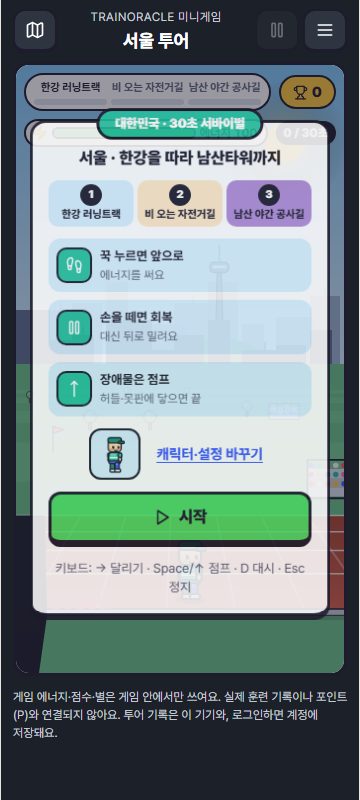
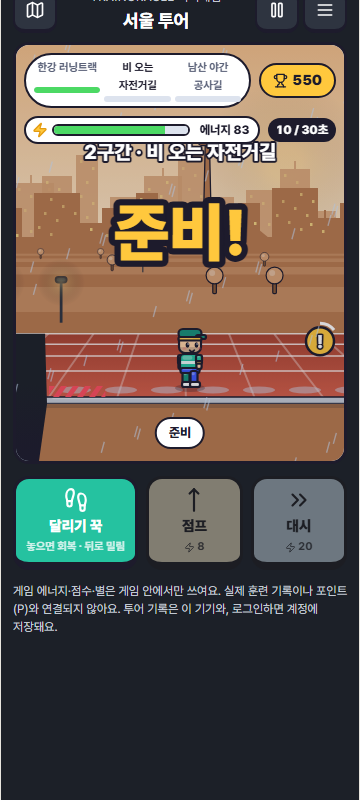
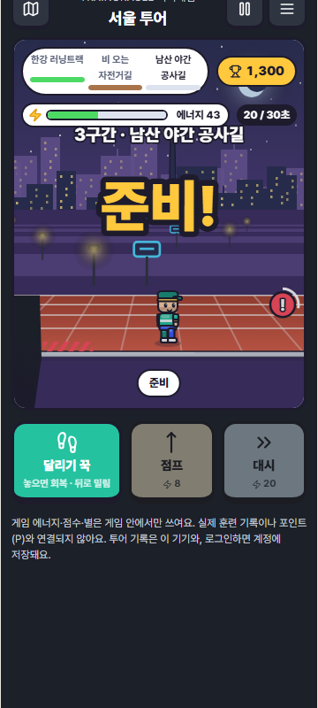
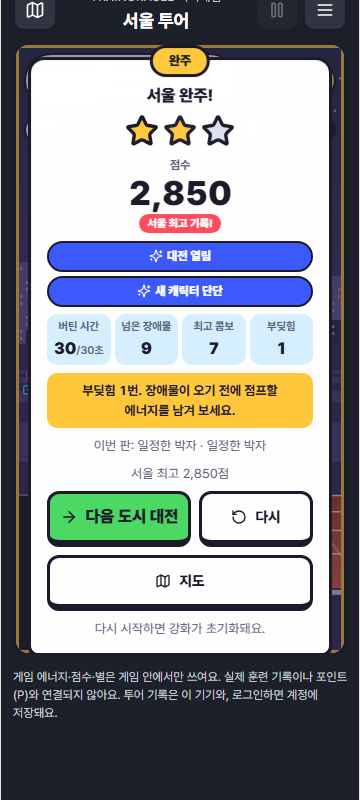
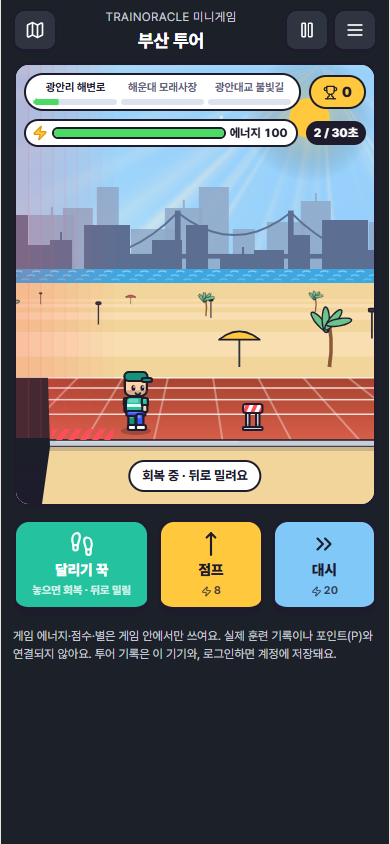
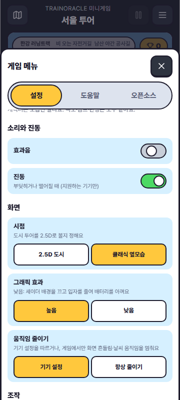
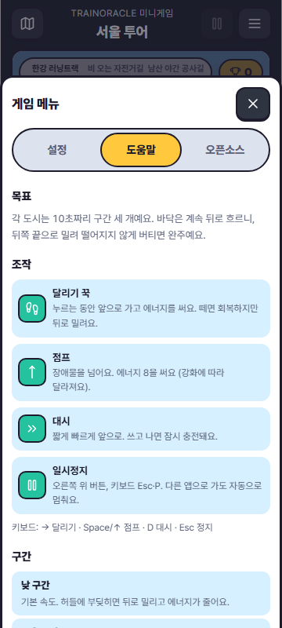
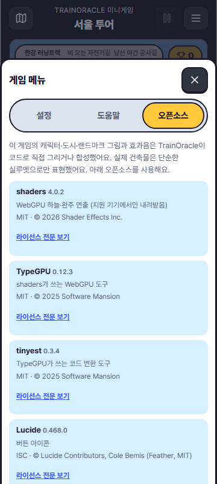

# 5차: 러닝 투어 시리즈 · 2.5D 도시 · 캐릭터 · 게임 메뉴 · 계정 저장

작성일: 2026-10-08.

오너 요청:
- "게임 내에 환경설정 탭을 만들고, 오픈소스 고지와 도움말도 넣자."
- "다음 레벨로 넘어가면 2.5D가 되면서 더 풍부한 에셋과 맵 효과가 나오게. 진짜 운동장이나 러닝하는 것처럼."
- "캐릭터도 몇 개 더 만들자."
- "서울·부산·대전·대구에 파리·런던·도쿄·오사카 등을 투어하는 확장형 시리즈로. 토스 만보계처럼 세계관이 꾸준히 이어지게."

질문으로 확인한 오너 결정:
- 실제 걸음이나 훈련 기록은 쓰지 않는다. 진행은 게임 안에서만 한다.
- 진행은 서버(계정)에도 저장한다.
- 첫 범위는 국내 4곳과 해외 4곳이다.

상태: PR #349 후속 커밋. 서버 마이그레이션은 **배포하지 않았다**. 플레이테스트 전이다.

## 무엇이 바뀌었나

| 영역 | 내용 |
|---|---|
| 세계관 | **러닝 투어**. 시즌 1 코리아 투어(서울 → 대전 → 대구 → 부산), 시즌 2 월드 투어(도쿄 → 오사카 → 파리 → 런던) |
| 도시 구성 | 도시마다 구간 세 개: 낮 트랙, 노을(비·모래·꽃잎·폭염 등으로 덜 나아가는 길), 밤(못판 구간). 규칙과 판정은 기존 엔진 그대로다 |
| 난이도 | 도시를 하나 넘을 때마다 바닥 속도가 +2.2% 오르고 장애물이 추가된다. 런던 밤 구간에서는 가운데 허들이 못판이 된다 |
| 2.5D | 도시 투어는 원근이 있는 시점이다. 지평선으로 모이는 400m 트랙 레인과 소실점으로 흐르는 가로줄을 그린다. 깊이에 따라 작아지고 느려지는 소품(관중석·깃발·가로등·야자수·파라솔·네온)과 3겹 스카이라인을 둔다. 판정선(d=1)은 기존 바닥선과 같아서 그림과 히트박스가 어긋나지 않는다 |
| 도시 아트 | 랜드마크는 단순한 실루엣이다: 남산타워, 한빛탑, 83타워, 광안대교, 도쿄타워, 오사카성, 에펠탑, 빅벤. 실제 로고나 사진은 쓰지 않고 코드로 그렸다. 노을과 밤에는 창문 불빛이 켜지고 가로등이 빛난다. 부산에는 바다 물결이 있다 |
| 날씨 | 비, 눈(런던 겨울밤), 벚꽃잎(도쿄·오사카), 폭염 아지랑이(대구), 바닷바람(부산). 모두 시계로 계산해 상태를 저장하지 않는다. 움직임 줄이기에서는 멈춘다 |
| 캐릭터 6종 | 토리(기본), 하나(포니테일), 단단(곰), 나비(고양이), R-01(로봇), 펭구(펭귄). **모습만 다르고 속도·점프·판정은 같다.** 서울 완주, 별 6개, 부산 완주, 별 18개로 해금한다 |
| 해금 | 도시를 완주(별 1개 이상)하면 다음 도시가 열린다. 부산을 완주하면 시즌 2가 열린다. 결과 카드에 "대전 열림", "새 캐릭터 단단"을 띄우고 **다음 도시** 버튼을 둔다 |
| 게임 메뉴(오른쪽 위 ≡) | **설정**: 캐릭터, 효과음, 진동, 시점(2.5D/클래식), 그래픽 효과(높음/낮음), 움직임 줄이기(기기 설정/항상), 버튼 크기, 달리기 버튼 위치, 점프 타이밍 표시, 저장 상태, 투어 초기화(확인 단계 있음). **도움말**: 목표·조작·구간·강화·별과 해금·훈련과의 관계. **오픈소스**: 게임이 쓰는 패키지 7개와 라이선스 전문 링크 |
| 효과음 | WebAudio로 합성한 짧은 소리: 카운트다운, 점프, 착지, 부딪힘, 통과, 구간, 완주, 실패. 음원 파일과 네트워크는 쓰지 않는다. 사용자가 누른 뒤에만 시작하고 설정으로 끌 수 있다 |
| 연습 | 기존 러닝머신 3구간은 지도 아래 **러닝머신 연습**으로 남겼다. 저장하지 않는다 |
| 더보기 | 미니게임 줄 설명을 "러닝 투어 · 서울에서 런던까지"로 바꿨다 |

## 저장 (오너 결정: 서버에도)

| 항목 | 내용 |
|---|---|
| 저장하는 것 | 도시별 별·최고 점수·완주 횟수, 고른 캐릭터, 게임 설정. **그 밖에는 없다** (스키마가 strict라 포인트·거리·통증 같은 필드는 거부된다) |
| 기기 | 계정별로 나뉜 localStorage 키 `trainoracle.minigame.progress.v1`. 오프라인에서도 바로 저장된다 |
| 계정 | 기존 암호화 계정 문서 저장소에 새 문서 종류 `MINIGAME_PROGRESS`를 추가했다. 새 테이블·권한·공개 필드는 없다 |
| 서버 변경 | `supabase/migrations/0064_minigame_progress_account_storage.sql`(0059와 같은 방식: 기능 확인 액션과 문서 종류만 추가), 게이트웨이 `minigameProgressSupport`, 소유자별 문서 ID, 검증기 재생성 |
| 충돌 처리 | 진행은 늘기만 하므로 묻지 않고 합친다. 별·최고 점수·완주 횟수는 큰 값이, 설정은 최신 값이 이긴다. 합치기는 교환·결합·멱등 법칙이 테스트로 증명돼 있다. 저장은 비교 후 교체(CAS)이고, 충돌하면 다시 읽어 합친 뒤 재시도한다 |
| 서버 보호 | 서버 검증기는 어떤 도시의 별·점수·횟수가 줄어드는 갱신을 거부한다. 처음부터 다시 하기는 문서 삭제로만 가능하다 |
| 보상 분리 | 메타데이터는 항상 `eligible:false`이다. SQL이 game 문서의 보상 자격을 거부하고, 포인트 요약은 게임 진행을 세지 않는다(PG 테스트). 진행 코드는 보상·꾸미기·일지·계획·기록 모듈을 import하지 않는다(테스트) |
| 실패 시 | 서버가 아직 이 기능을 모르거나(0064 미배포) 오프라인이거나 동의가 없으면 "이 기기에 저장"으로 남는다. 다음 접속이나 온라인 복귀 때 다시 시도한다 |
| 킬스위치 | 계정 문서 저장(`ACCOUNT_JOURNAL_V2`)을 끄면 함께 닫힌다. 게임만 닫으려면 `VITE_KILL_MINIGAME_PROGRESS=true`를 쓴다(런북에 기록함) |

## 검증

| 항목 | 결과 |
|---|---|
| 앱 TypeScript | 통과 |
| 미니게임·투어·진행·동기화·렌더러·고지 단위 | 투어 6, 진행 9, 엔진 19, 동기화 계약 8, 렌더러 2, 셰이더 7, 고지 3 |
| 투어 밸런스 가드 | 8개 도시 × 강화 3종을 모두 사람처럼 플레이(달리고 쉬고 맞춰 점프)하면 완주한다. 가만히 있거나 달리기만 누르면 첫 도시와 마지막 도시 모두 실패한다. 부주의한 플레이는 마지막 도시에서 더 빨리 끝난다 |
| 계정 API·상태 계약 | `src/domain/account` 전체와 관련 계약: 118개 파일, 1326개 통과 |
| 서버 검증기 | 재생성 후 `--check` 통과, 검증기 테스트 통과 |
| 게이트웨이 핸들러 | 85/85. 새 테스트: 기능 확인, 다른 소유자 ID 거부, 포인트 필드 거부, 별 감소 거부, 암호문에 도시 이름 없음, 보상 메타 `eligible:false`, 옛 SQL·잘못된 버전·게이트 닫힘에서 실패 |
| PostgreSQL(PGlite) | 0001~0064 전체를 그대로 실행한다. 기능 확인 액션, CAS, 보상 자격 거부, 문서 종류 바꿔치기 거부, 미지정 종류 거부를 확인했다. **0064를 빼면 실패**한다(결함 주입) |
| 브라우저(WebGPU 없음) | 10/10, 데스크톱·폰. 실제 키로 서울을 완주해 별이 저장되고, 대전 해금과 단단 해금 알림이 뜨고, 새로고침 후에도 유지되는 것을 확인했다. 메뉴 설정이 화면에 반영되고 저장된다. 도움말을 열고, 라이선스 링크 7개가 모두 200으로 응답한다. 외부 요청 0건, 가로 스크롤 없음 |
| 브라우저(실제 Chrome+WebGPU) | 1/1. 부산 2.5D와 셰이더 하늘을 띄우고, 그래픽 효과를 "낮음"으로 바꾸면 셰이더가 내려간다. 외부 요청 0건 |
| 결함 주입 | 앱 9/9 감지: 줄어드는 갱신 허용, 병합에서 별 손실, 실패를 완주로 처리, 시즌 잠금 해제, 난이도 폭증, 렌더러 구간 이름, 동기화 덮어쓰기, 킬스위치 무시, 스키마에 추가 필드 허용. 서버 2/2 감지: 소유자 ID 검사 제거, 0064 누락. 고지 1/1 감지: 전이 의존성 누락 |
| 전체 Vitest | 실패 92개. 기존 부하성 실패(PlanBeta·PaceCalculator·Oracle 등)와 같은 분포다. 이번에 확인한 실패 2개(쉬운 말 문구 `workout-memo-presentation.ts`, 홈 코칭 요약)는 이 작업을 빼둔(stash) 기준 코드에서도 똑같이 실패한다 |
| 빌드 | 통과. 게임 청크 JS 93.0 kB / gzip 31.1 kB, CSS 31.3 kB. 셰이더 라이브러리 2.6 MB는 지원 기기에서 게임을 열 때만 받는 지연 청크이고, 진입 HTML에는 없다 |

테스트가 실제로 찾아낸 문제(모두 고쳤다):
- 런던 밤 구간에 0.85초 간격의 장애물이 생겨 착지 후 다시 뛸 수 없었다 → 추가 장애물 대신 가운데 허들을 못판으로 바꿨다
- 도시 투어 카운트다운에 "3구간 · 가시밭"처럼 연습 코스 이름이 떴다 → 렌더러가 현재 코스의 구간을 읽게 고쳤고, 회귀 테스트를 추가했다
- "구간 통과!" 글자가 카운트다운 위에 겹쳤다 → 구간이 바뀌면 지운다
- 오픈소스 고지에 TypeGPU의 전이 의존성 `typed-binary`(MIT)와 `tsover-runtime`(**Apache-2.0**)이 빠져 있었다 → 추가했고, 이제 테스트가 잠금 파일에서 의존성 트리를 직접 읽는다
- 설정 선택 줄이 다음 줄과 겹쳤다(grid 행 높이) → 고쳤다

## 화면

| 투어 지도 | 서울 시작 | 비 오는 구간 | 밤 구간 |
|---|---|---|---|
|  |  |  |  |

| 완주와 해금 | 부산 + WebGPU | 설정 | 도움말 | 오픈소스 |
|---|---|---|---|---|
|  |  |  |  |  |

## 도시 추가 방법 (시즌 3 이후)

1. `app/src/domain/minigame/tour.ts`의 `TOUR_CITIES`에 도시 하나를 추가한다(새 `season` 값이면 `TOUR_SEASONS`에도). id는 저장 키이므로 바꾸거나 재사용하지 않는다.
2. 새 랜드마크가 필요하면 `screens/treadmill/city-art.ts`의 `landmark()`에 실루엣을 하나 추가한다.
3. `npx vitest run src/domain/minigame`을 돌린다. 밸런스 가드가 새 도시도 자동으로 검사한다(완주 가능 여부, 장애물 간격 1.1초 이상, 마지막 도시가 더 어려운지).

서버 스키마는 도시 id를 형식으로만 검사하므로, 도시를 추가할 때 마이그레이션은 필요 없다.

## 오너 확인이 필요한 것

- **0064 마이그레이션 배포.** 배포 전까지 진행은 "이 기기에 저장" 상태로 동작한다. 배포는 오너 승인 사항이다.
- **`.github/workflows/ci.yml`**: 빌드 환경에 `VITE_KILL_MINIGAME_PROGRESS: ${{ vars.TRAINORACLE_KILL_MINIGAME_PROGRESS }}` 한 줄 추가가 필요하다. 에이전트 토큰에 workflows 권한이 없어 직접 수정하지 못했다.
- 개인정보처리방침에 "미니게임 진행(별·점수·캐릭터·설정)을 계정에 저장" 항목을 넣을지 판단이 필요하다. 건강 정보가 아니고 동의 범위도 기존 계정 저장을 그대로 따르지만, 고지 문구는 오너 결정 사항이다.
- 앱 전체 오픈소스 고지(`public/legal/open-source.html`, 컬렉션 생성기 대상)에 소프트웨어 항목을 넣는 일. 게임 안 고지는 완료했다.
- 실제 휴대폰에서 2.5D와 날씨의 프레임·발열, 효과음 볼륨 확인.
