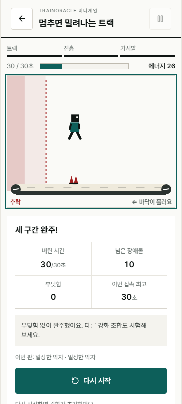

# 이번 구현의 확인 결과

## 2차 개선 확인 (2026-10-07, 규칙 v2)

Windows / Chromium. 빌드는 저장소 런타임 가드에 따라 Node 24.19.0으로 실행했다.

| 확인 | 결과 |
|---|---|
| 앱 TypeScript | `npm run typecheck` 통과 |
| 경기 엔진 | 17/17 (생존 규칙 14 + 밸런스 가드 3) |
| 셸·홈·시각 계약 | 셸 1/1, 홈 7/7, 시각 8/9 — 실패 1개는 아래 기존 Trends 불일치와 동일 |
| e2e 타입 | 오류 2개, 모두 아래 기존 `reducedMotion` fixture. 새 오류 없음 |
| 실제 브라우저 | **6/6** (데스크톱 900×900, 모바일 360×800). 완주 시나리오는 엔진으로 계획한 입력을 실제 키로 재생 |
| 결함 주입 | 6/6 감지: 접지 이점 제거, 장벽 밀림 제거, 판정 폭 확대, 접지 비용 제거, 추락 제거, 회복 제거. 원본 복구 확인 |
| 빌드 | 통과. 게임 청크 JS 24.10 kB / gzip 8.73 kB, CSS 9.61 kB |

아래는 1차 구현 당시 기록이다.

## 1차 구현

확인일: 2026-10-07. 기준 코드: main `a94a768fa2fb3463976ddf4356f2e0a2b4ed4a05`. Windows / Node 24.19.0 / Chromium에서 확인했다. 실행 코드와 보존용 자료를 구분하며, 아래 결과는 로컬 확인이다.

## 통과한 확인

| 확인 | 결과와 범위 |
|---|---|
| 앱 TypeScript | `tsc --noEmit` 통과. 최종 마크업 변경 후 재확인 |
| 새 브라우저 테스트의 TypeScript | 새 `treadmill-game.spec.ts`와 `playwright.treadmill.config.ts`만 포함한 임시 설정으로 통과 |
| 경기 엔진 단위 테스트 | 11/11. 무행동 추락, 공간을 벌고 회복, 소진 상태에서 달리기를 놓아야 회복, 점프·착지, 대시 충전, 충돌, 구간 정지, 강화 이점·비용, 완주·초기화, 불변 상태·프레임 차이 |
| 셸의 게임 진입·복귀 | 1/1. 더보기 → 미니게임 → 더보기 |
| 함께 확인한 기존 홈·시각 계약 | 홈 7/7, 시각 8/9. 시각 실패 1개는 아래 기준 코드 불일치 |
| 실제 브라우저 | **6/6**. 데스크톱 900×900, 모바일 에뮬레이션 360×800에서 각각 3개 시나리오 |
| 결함 주입 | 3/3 감지. 추락 제거, 강화 비용 제거, 달리기 중 소진 에너지 회복을 임시 복사본에만 주입. [검출 기록](mutation-checks.json) |
| 앱 빌드 | TypeScript와 `vite build --emptyOutDir=false` 통과. 최종 게임 청크 12.78 kB / gzip 5.12 kB. 기존 청크·폰트 경고는 아래 기록 |

집중 Vitest 실행의 전체 결과는 **27개 통과, 기존 시각 검사 1개 실패**다. 새 게임 테스트만의 성공을 전체 저장소 테스트 성공으로 해석하지 않는다.

브라우저 시나리오는 (1) 무행동 실패·재시작·누르기/놓기·회복·정지·앱 복귀·새 경기, (2) 실제 키보드로 세 구간 완주·강화 선택·안전 발판 정지·완주 후 초기화, (3) 초점 상실 정지·모션 감소·대시·작은 화면의 가로 넘침 확인이다. 게임 상태를 테스트에서 직접 바꾸지 않는다. Playwright의 시계를 멈춰 입력·스크린샷에 걸리는 시간과 게임 진행 시간을 분리했다. 테스트 서버는 루프백에만 열고 외부 요청을 차단했다.

## 남아 있는 기준 코드의 실패

이번 PR에서 수정하지 않은 아래 파일을 기준 main과 비교했다.

1. `src/styles/visual-system.contract.test.ts`의 `keeps the analysis back label on one line without widening its symmetric header tracks`는 `64px minmax(0, 1fr) 64px`를 기대한다. 기준 코드의 `Trends.tsx`는 이미 `64px minmax(0, 1fr) auto`를 사용한다. 두 파일 모두 이번 변경에 포함되지 않는다.
2. 전체 `npm run typecheck:e2e`는 기존 `e2e/feature-discovery-journey.spec.ts:6`과 `e2e/write-first-journey.spec.ts:5`의 `reducedMotion` fixture 속성에서 TS2353 두 개를 반환한다. 두 파일 모두 기준 코드와 동일하다. 새 게임 파일 두 개의 타입 확인은 별도로 통과했다.

빌드에는 기존 Pretendard 폰트의 런타임 경로 해석 경고, 기존 도메인의 정적/동적 import 중복 경고와 500 kB 이상 기존 청크 경고가 나온다. 게임에 외부 폰트·이미지·분석 SDK·새 패키지를 추가하지 않았다. 잠금 파일과 GitHub Actions 설정은 변경하지 않았다.

## 실행 명령과 화면

`app`에서 실행한다. Chromium 설치가 필요하며, 저장소의 Windows 런타임 가드에 맞는 Node를 사용한다.

```sh
npm run typecheck
npx vitest run src/domain/minigame/treadmill.test.ts src/AppShell.minigame.contract.test.tsx src/AppShell.home-hub.contract.test.tsx src/styles/visual-system.contract.test.ts
npm run typecheck:e2e
npm run test:e2e:treadmill
npm run build
```

전체 e2e 타입 확인의 기존 실패를 분리하려면 `app/.scratch/treadmill-e2e-types.json` 같은 임시 파일에 다음 설정을 저장하고 `npx tsc --noEmit -p .scratch/treadmill-e2e-types.json`을 실행한다. 임시 파일과 생성된 테스트 결과는 PR에 포함하지 않는다.

```json
{
  "extends": "../tsconfig.e2e.json",
  "include": ["../e2e/treadmill-game.spec.ts", "../playwright.treadmill.config.ts"]
}
```

현재 구현의 확인 화면:

- [데스크톱 강화 선택](screenshots/desktop-checkpoint.png), [데스크톱 완주](screenshots/desktop-clear.png)
- [모바일 강화 선택](screenshots/phone-checkpoint.png), [모바일 완주](screenshots/phone-clear.png)



## 이 결과가 증명하지 않는 것

전체 저장소 테스트와 모든 브라우저·실물 기기 검사를 수행하지 않았다. 모바일 에뮬레이션은 실제 휴대폰의 달리기 유지+점프 동시 터치를 대신하지 않는다. 그 동작과 장애물 가독성은 [P0 백로그](BACKLOG.md)에 있다. 에너지·지형·강화의 밸런스, 재미와 자발적 재방문·친구 플레이는 아직 사람의 플레이테스트로 검증하지 않았다.

자료 작성 시점에는 원격 PR CI 결과가 없었다. PR의 현재 Checks를 따로 확인해야 한다. 이번 작업은 초안 PR 제안이며 병합·운영 배포·실제 계정 연동의 확인이 아니다. 게임은 로그인·훈련 기록·P·서버 저장을 연결하지 않는다.
