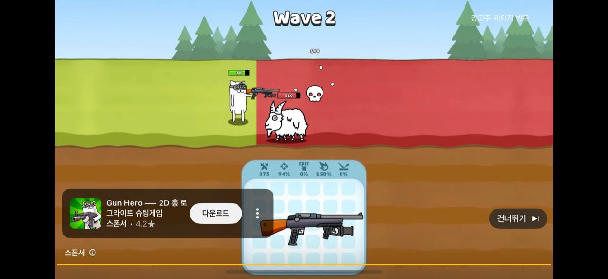
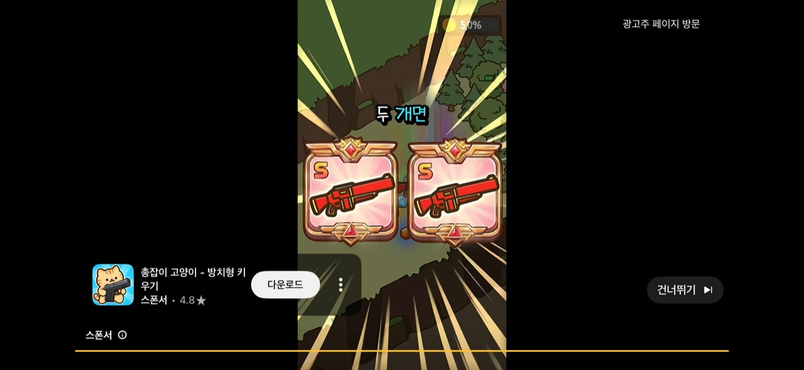
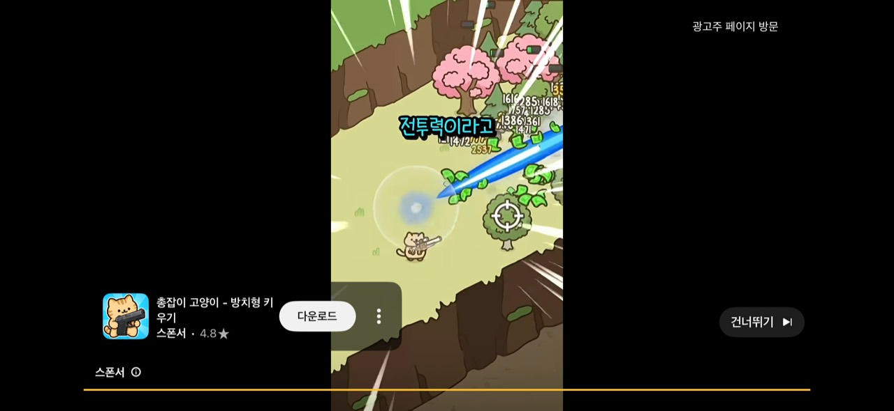

# 사용자 첨부 참고 사진

Gun Hero와 고양이 성장 게임 광고의 화면을 사용자가 기획 참고로 첨부했다. **제출 24개 / 고유 이미지 17개**를 SHA-256으로 대조해 보존했다. 반복 첨부한 7개도 [manifest.json](manifest.json)의 원래 묶음·파일명·원본 해시·저장 파일 매핑으로 추적할 수 있다.

- `gun-hero`: 첫 첨부 1개. 작은 2D 전투 무대와 하단 장비 화면.
- `cat-growth`: 10개. 아이템 획득·같은 아이템 합성·성능 연출 변화.
- `cat-laser`: 6개. 다수 아이템·등급 상승·큰 레이저 효과.
- `cat-repeat`: 7개. 앞선 묶음에서 반복된 사진. 중복 바이너리를 다시 저장하지 않았다.

이 사진은 원저작자의 게임·광고 화면이다. 공개 배포용 게임 에셋의 라이선스를 확보했다는 뜻이 아니다. 참고 문서에만 보존하며 앱 코드·배포 정적 자산은 이 폴더를 읽지 않는다. 실제 구현은 외부 그림 없이 단순 도형으로 그린다.

