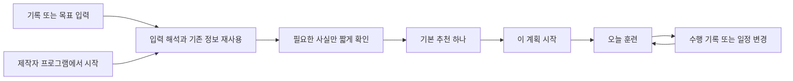

# TrainOracle 간편 계획·크리에이터 프로그램 제품 기획 및 개선계획

- 작성일: 2026-09-20
- 문서 상태: 오너가 승인한 제품 방향을 구체화한 기획안. 구현·출시 완료 보고서 또는 새 훈련 처방의 채택 문서가 아니다.
- 이번 결정: 최소 입력, 기본 추천 하나, 바로 시작, 좋아하는 사람의 프로그램을 내 일정으로 가져오기.
- 이번 산출물: 제품 경험, 출시 범위, 현행 스펙 변경점, 실행 작업과 수용 기준.
- 외부 AI/API: 지금 새로 연결하지 않는다. 기존 앱의 계정·저장 기능은 재사용하고, 미래 외부 판단 기능을 연결할 경계만 설계한다.

## 1. 제품의 중심

**TrainOracle은 사용자가 훈련을 설계하는 도구가 아니라, 다음에 할 훈련이 준비되어 있는 서비스가 된다.**

사용자가 얻는 것은 ‘대단한 분석 보고서’보다 먼저 **오늘 할 일, 이미 채워진 일정, 선택을 끝내 주는 추천**이다. 좋은 코칭 지식과 정교한 엔진은 이 간단한 결과를 지탱한다. 개인 페이스와 훈련의 타당성을 없애서 간단하게 만드는 것은 아니다.

두 개의 진입 경로를 하나의 제품으로 묶는다.

| 진입 | 사용자의 생각 | 서비스가 하는 일 | 주 행동 |
|---|---|---|---|
| 바로 내 계획 | “뭘 해야 할지 모르겠어. 알아서 정해 줘.” | 기록 또는 목표로 시작해 적합한 기본안 하나를 준비 | 내 계획 받기 → 이 계획 시작 |
| 이 사람처럼 훈련 | “이 사람 프로그램이면 해 보고 싶어.” | 선택한 원본을 적용 가능한 내 계획으로 변환 | 내 계획으로 시작 |

두 경로 모두 시작 후에는 같은 ‘오늘 훈련’ 화면으로 도착한다. 사용자는 엔진, 생성 방식, 추천 알고리즘, 날짜 모드를 선택하지 않는다.

### 확정 방향과 검증할 가설

- **제품 결정:** 기본 화면은 추천 하나와 주 행동 하나. 고급 설정·원리·다른 후보는 필요할 때 연다.
- **제품 결정:** 기록/목표 진입과 제작자 프로그램 진입을 첫 제품 범위에 함께 포함한다.
- **제품 결정:** 목표만 있는 사용자를 부차적인 실패 경로로 취급하지 않는다. 그 대상에게 제공할 검토된 시작 프로그램을 별도로 준비한다.
- **검증할 가설:** 다수 사용자가 선택·설문보다 즉시 결과를 선호한다. 이는 오너의 우선 제품 가설이며, 현재 확보된 이용자 조사 수치가 아니다.
- **검증할 가설:** 좋아하는 사람의 이름·훈련 흐름이 첫 수행과 재사용을 늘린다. 팔로워 수만으로 효과를 추정하지 않는다.
- **검증할 가설:** 현재 규칙 엔진과 검토된 프로그램만으로 초기 핵심 경험을 충분히 제공할 수 있다. 외부 모델의 가치는 이후 같은 과업에서 비교한다.

## 2. 첫 사용: 결과부터 이해되는 세 화면

### 화면 A — 한 줄로 시작

일반 유입의 첫 화면:

> **다음 훈련, 바로 준비해요.**  
> [예: 5km 25분 / 5km 22분 목표]  
> **내 계획 받기**

- 기록/목표 문장을 정해진 형식으로 해석하는 작은 입력 파서를 쓴다. 자유 대화형 AI 입력창으로 만들지 않는다.
- 바로 아래 `5km · 내 기록 25:00` 또는 `5km · 목표 22:00`을 보여주고 그 자리에서 고칠 수 있게 한다.
- `25분`만 들어왔고 종목 문맥이 없다면 거리만 묻는다. 숫자를 보고 5km라고 추정하지 않는다.
- 기존 회원의 유효한 기록·설정은 재사용한다. 오래된 PB를 최근 능력으로 바꾸거나, 여러 기록의 기준을 조용히 바꾸지 않는다.
- 제작자 링크에서는 프로그램 종목을 미리 채울 수 있다. 종목이 다른 기록을 자동 환산하지 않는다.
- 필요한 사실이 빠졌으면 같은 입력 화면에서 해당 항목만 짧게 확인한 뒤 개인 결과로 이동한다. 확인 화면을 연속으로 넘기는 설문 흐름은 만들지 않는다.
- 공개 프로그램 소개는 계정 생성 전에 볼 수 있게 설계한다. 개인 계획 저장에 계정이 필요하면 결과를 보존한 채 그 시점에 연결한다. 기존 저장 계약 밖의 익명 서버 저장은 새로 만들지 않는다.
- 예시 문구와 탐색 메뉴는 실제 출시 범위에 맞춘다. 지원하지 않는 종목을 개인 처방 가능 상품처럼 광고하지 않는다.

### 화면 B — 추천 하나를 바로 이해

> **오늘의 훈련**  
> [적격성 확인 후 기존 엔진이 산출한 핵심 훈련]  
> [확정된 시간·분량과 다음 일정]  
> 기준: 5km 25:00 · [기록 날짜]  
> **이 계획 시작**  
> 전체 일정 · 기준 바꾸기 · 자세히

위 괄호는 구현 시 실제 결과가 들어갈 위치다. 이 문서는 새 훈련량·반복 수·페이스·회복시간을 정하지 않는다. 휴식일이라면 휴식을 정상 결과로 보여주고 다음 훈련을 함께 안내한다.

첫 화면에 필요한 것은 ‘무엇을 하는가’, ‘언제 하는가’, ‘어떻게 시작하는가’다. 원리·세부 근거·전체 달력은 아래 또는 펼치기 안에 둔다. 적용할 프로그램·기준기록·시작일은 짧게 보이게 남긴다.

**추천을 선택하고 기준을 확인하는 중복 단계를 ‘이 계획 시작’ 한 번으로 합치는 후속 계약을 만든다.** 버튼을 누르기 전까지는 개인 계획을 활성화하거나 기존 계획을 교체하지 않는다. 공개·팔로우·기록 인증은 이 행동에 묶지 않는다.

### 화면 C — 재방문은 오늘 할 일

> **오늘 할 훈련**  
> [핵심 내용]  
> **훈련 보기**  
> 오늘은 어려워요 · 전체 일정

- 매번 새 계획을 뽑거나 프로그램을 다시 고르게 하지 않는다.
- 진행 중 계획이 없는 사람은 바로 계획 받기, 있는 사람은 오늘 훈련이 기본이다.
- 기록 작성은 완료 흐름과 기존 기록 진입에서 쉽게 접근하게 유지한다.
- 초기에는 실제 운동 추적기가 없는 버튼을 ‘측정 시작’처럼 보이게 만들지 않는다. 훈련 안내와 실제 측정 기능을 구별한다.
- `했어요`는 사용자의 수행 보고로 저장한다. 측정된 거리·시간 또는 검증된 기록이 생긴 것으로 간주하지 않는다.
- 이미 가진 구조화된 자료로 ‘수행한 세션/남은 세션/다음 훈련’을 짧게 보여준다. 목표 달성 확률·체력 상승을 만들어내지 않는다.

이미 유효한 정보가 있으면 추가 질문은 생략한다. 정보 부족·통증·일정 충돌 등 실제로 결과를 바꾸는 조건은 해당 시점에만 드러난다.

## 3. ‘기록 하나’의 약속을 성립시키는 프로그램 공급

입력 수를 줄이는 것만으로 충분하지 않다. **정보가 적은 사용자에게도 정직하게 제공할 수 있는 프로그램**이 있어야 한다.

| 사용자 상태 | 바로 보여줄 가치 | 개인 실행 계획을 확정하는 조건 |
|---|---|---|
| 필요한 유효 정보가 이미 있는 회원 | 개인 페이스가 적용된 추천과 일정 | 기준과 프로그램을 한 행동으로 확인 |
| 같은 종목 기록이 있는 신규 사용자 | 기록 해석과 적합한 프로그램 결과 | 기록 현재성·적용 대상·몸상태 등 해당 프로그램에 꼭 필요한 사실 확인 |
| 목표만 있고 현재 기록이 없는 사용자 | 목표를 보존한 검토된 시작 프로그램 | 현재 기록을 요구하지 않도록 설계·채택된 범위 및 필요한 최소 사실 충족 |
| 오래된 PB만 있는 사용자 | 목표/관심에 맞는 프로그램 소개와 기준 상태 | 현재성 계약을 충족하거나 기록 비의존 시작 경로 사용 |
| 부적격·현재 몸상태 불명·미지원 대상 | 상황에 맞는 짧은 안내와 다음 행동 | 기존 차단 조건을 해소하지 않은 개인 처방은 생성하지 않음 |

### 신규 프로그램 채택은 P0 작업

현행 상세 처방의 채택 범위는 같은 종목의 현재 기록을 가진 숙련자와 800/1500/3000/5000m의 특정 템플릿이다. 초보자 상세 버전과 대중 장거리 상세 템플릿이 모두 준비되어 있다는 전제로 계획하지 않는다.

첫 기술 검증은 기존 5000m 경로를 재사용하기 좋다. 다만 **숙련자 5000m 경로만 완성하고 대중용 제품이 완성됐다고 부르지 않는다.** 같은 출시 묶음에서 ‘목표만 있는 사람’의 시작 프로그램을 검토·채택하는 작업을 병렬로 진행한다. 적용 대상·제외 조건·최소 사실·변경 가능한 변수·진행 조건을 함께 정한다. 세부 종목 확대 순서는 관찰한 유입 수요와 프로그램 준비 상태로 정한다.

첫 공급 목록에는 **목표만 있는 사용자도 시작할 수 있는 제작자 승인 프로그램 1개**를 포함한다. 일반 목표-only 프로그램과 기록 보유자용 제작자 프로그램을 각각 만들고 두 요구가 모두 충족됐다고 계산하지 않는다. 해당 원본에 기록 비의존 시작 버전의 근거·허용 범위가 없으면 제작자와 검토자가 별도 버전을 준비해야 한다. 준비 전에는 그 상품의 기록 요건을 시작 버튼 전에 표시하고, 목표-only 따라하기는 아직 미완료로 남긴다.

### 추가 질문의 예산

- 저장되어 있고 현재 유효한 사실은 다시 묻지 않는다.
- 질문의 답이 추천·적격성·일정에 영향을 주지 않으면 첫 과정에서 제거한다.
- 누락 정보는 짧은 확인 화면 하나에 모을 수 있지만, 여러 질문을 숨겨 ‘한 번 입력’으로 집계하지 않는다.
- 출하 전에 프로그램별 실제 필수 응답 수와 화면 수를 확정한다. 간편 경로의 설계 목표는 최초 기록/목표 외 추가 사실 0~2개, 확인 화면 최대 1개다. 계정 연결의 부담은 별도로 측정한다. 필요한 사실이 이 예산을 넘으면 필수 조건을 빼지 말고 그 상품의 대상·시작 버전·초기 제공 범위를 재검토한다.
- 최초 이용자에게 프로그램의 필수 사실이 부족하면 꼭 필요한 답은 받는다. 몸상태 UNKNOWN을 정상으로 기본 선택하지 않는다.
- 해당 대상에서 필수 질문이 계속 많다면 질문을 감추는 대신 프로그램의 적용 범위·필요 정보·제품 약속을 재설계한다.
- 완료에 필요한 사실을 확인하기 전에는 공개 예시와 실행 가능한 개인 계획을 구별한다. 차단된 개인 처방을 뒤에서 생성해 놓고 ‘미리보기’로 우회하지 않는다.

목표만 입력한 사용자의 목표 페이스를 현재 가능한 훈련 페이스로 사용하지 않는다. ‘첫 훈련부터 알아서 맞춰가요’ 같은 문구도 실제 반영 규칙이 구현·채택된 범위에서만 쓴다.

## 4. ‘이 사람처럼 훈련’은 추천 세트 상품

### 상품 단위

사람 자체나 일지 전체를 복사하는 기능이 아니다. **제작자가 배포를 허용하고, 다른 사용자가 시작할 수 있도록 검토된 특정 프로그램**을 상품 단위로 삼는다.

> **[제작자]의 [프로그램 이름]**  
> [누구를 위한 프로그램인지 한 줄]  
> [기간] · [종목] · [검토된 적용 수준]  
> **내 계획으로 시작**

원본 페이지에서 들어온 사용자는 이미 메뉴를 골랐다. 다시 추천 목록이나 여러 생성 모드를 통과시키지 않는다. 필요한 내 기록/목표만 받아 같은 개인 계획 화면으로 연결한다.

일반 홈은 자동 추천 하나를 먼저 보여준다. `다른 프로그램 보기`에서만 소수의 메뉴를 탐색한다. 첫 공급 목표는 기본 프로그램과 구분되는 소수의 허용된 제작자 프로그램이다. 수십 개의 비슷한 카드를 만드는 것은 출시 조건이 아니다.

### 날짜는 프로그램이 정하고 사용자는 시작한다

| 프로그램 종류 | 기본 동작 | 사용자 표시 | 예외 |
|---|---|---|---|
| 지난 훈련/상시 프로그램 | 원본의 상대 날짜·순서·회복 관계를 개인 시작일에 옮김 | 오늘부터 [기간] / 같은 순서로 시작 | 가능한 날과 충돌하면 검토된 재배치만 제안 |
| 앞으로 함께하는 일정형 프로그램 | 게시된 실제 날짜와 프로그램 시간대를 보존 | [날짜]부터 함께 시작 | 중도 참가 적격 지점이 없으면 다음 시작일 또는 상시 버전 제안 |

일반 사용자에게 위 두 모드를 고르게 하지 않는다. 상품에 기본 방식을 고정한다. 과거 절대 날짜를 오늘의 일정으로 옮긴 경우 ‘날짜까지 동일’이라고 표시하지 않는다. 놓친 훈련을 몰아서 붙이거나 고강도 단계에 바로 끼워 넣지 않는다.

첫 따라하기 출시는 상시 프로그램으로 완결한다. 실제 같은 날짜에 함께하는 상품은 날짜·중도 합류 규칙까지 검증한 다음 증분으로 연다. 두 방식의 데이터 계약은 처음부터 구별한다.

### 무엇을 같게 하고 무엇을 맞추는가

- 가능한 한 유지: 원본의 훈련 목적, 세션 순서, 주기 구조, 핵심 회복 관계.
- 개인화 가능: 해당 프로그램에서 명시적으로 허용한 페이스·분량·일정 변수만.
- 허용하지 않음: PB 비율로 엘리트의 주간 거리·반복 수·빈도·휴식시간을 일괄 곱하기, 종목 간 임의 기록 환산.
- 변경이 작고 정해진 범위 안이면 `같은 구성 · 내 기록 기준`처럼 표시한다.
- 구성 자체가 크게 달라지면 검토된 별도 파생 프로그램으로 취급하고 `[원본] 기반`으로 표시한다. 원본을 똑같이 수행한다고 광고하지 않는다.
- 현재 수준에 적용할 변형이 없으면 더 낮은 수준의 다른 메뉴 하나를 제안한다. 유명인 이름을 유지하기 위해 임의 처방하지 않는다.

### 제작자·공개·재사용

기존 공개 카드에 상세 처방을 덧붙이지 않고, 별도로 게시한 공개 프로그램을 만든다. 사용자의 기존 개인 계획·일지·기준기록은 자동 공개하지 않는다.

게시할 때 정할 것: 원저자와 출처, 확인된 협업 여부, 공개 열람 범위, 개인화 사용 허용 범위, 사본 보유 조건, 상업적 노출 여부, 버전, 검토자와 적용 대상, 철회 처리.

일지 공개와 ‘따라하기 허용’은 별도 동작이다. 게시물이 공개되어 있다는 사실만으로 상품 재사용 권한이 있다고 처리하지 않는다. 실존 선수·유명인의 이름이나 사진으로 공식 추천·제휴 관계를 꾸미지 않는다. 처음에는 사용이 허용된 원본과 직접 검토한 프로그램으로 공급한다.

팔로워 수는 탐색·친숙함에 쓴다. 추천 자격·훈련 효과·안전성을 대신하지 않는다. 같은 적격성 안에서도 최초 기본 추천은 명시적인 기준과 안정적인 동률 처리로 결정한다.

## 5. 복사 이후가 제품의 핵심

### 진행 중 계획은 안정적으로 유지

- 시작할 때 원본의 버전과 내 적용본을 고정한다. 제작자의 수정으로 내일 훈련이 몰래 바뀌지 않는다.
- 반복 클릭·새로고침·네트워크 재시도로 동일 계획을 여러 개 만들지 않는다.
- 이미 진행 중인 계획이 있으면 새 계획의 시작/교체 의미를 짧게 확인한다. 두 계획을 조용히 겹치거나 기존 계획을 덮어쓰지 않는다.
- 시작을 누른 순간 원본 버전·재사용 권한·기준기록·안전/적격성·초안 변경 상태를 다시 확인한다. 이는 추가 설문이 아닌 저장 직전 내부 검사다. 결과를 본 뒤 조건이 달라졌다면 오래된 안을 저장하지 않고 바뀐 이유와 갱신된 결과를 보여준다.
- 저장 실패·오프라인·충돌 때 성공으로 표시하지 않는다. 입력과 결과를 보존하고 같은 행동으로 재시도할 수 있게 한다.
- 제작자 팔로우, 내 계획 공개, 알림 수신은 계획 시작과 별개다.

공개 프로그램 첫 출시부터 철회 시 신규 적용을 막고, 기존 개인본의 보유 범위와 사용자 안내를 게시 약속에 따라 처리한다. 안전상 리콜은 영향을 받는 미래 훈련의 상태를 명확히 표시하고 기존 안전 계약에 따라 재검토한다. 수행 기록을 조용히 삭제하거나 덮어쓰지 않는다. 최소 차단·안내는 P0이며 제작자 셀프 처리와 운영 자동화만 이후로 미룬다.

### ‘오늘 못 해요’도 간단하게

한 번에 추천하는 변경은 하나다. 이미 수행한 기록을 보존하고, 허용된 범위에서 미래 일정을 바꾸는 안을 보여준다. `이번 훈련을 [날짜]로 옮깁니다`처럼 실제 영향을 표시한 뒤 적용한다. 안전한 재배치가 없으면 쉬거나 건너뛰는 기존 허용 경로를 사용하며, 미수행 훈련을 빚처럼 쌓지 않는다.

이 기능에 필요한 재배치 규칙이 아직 없으면 첫 버전은 기존 허용된 건너뛰기/수동 변경으로 범위를 제한한다. ‘자동 조정’이라는 버튼만 먼저 붙이지 않는다.

### 분석·추천·요약의 위치

분석은 매번 별도 보고서로 읽히게 하지 않는다. 수행 뒤 또는 다음 훈련에서 ‘무엇을 했고 다음에는 무엇을 할지’ 짧게 보여준다. 사용자가 원하면 근거를 펼친다. 요약은 현재 승인된 구조화 관측과 결정적 계산, 검토된 문장 템플릿으로 만들 수 있다.

수행 여부·횟수·거리 비교를 체력 향상·부상 위험 해제·자동 증량의 증거로 승격하지 않는다. 취향 반영, 일정 변경, 훈련 효과 추정은 각각 다른 기능이며, 초기 제품은 앞의 두 가지도 승인된 범위에서만 수행한다.

## 6. 현행 기반과 새 계약의 경계

| 현행 정적 근거 | 재사용 | 이번에 필요한 증분 |
|---|---|---|
| 행동 중심 정보 계층·접힌 설명 | 레이아웃/설명 컴포넌트/실제 상태 노출 | 계획 유무에 따른 기본 홈, 첫 행동을 간편 계획으로 연결 |
| 기록·안전·템플릿 확인 후 계획 생성 | 기존 개인 페이스·후보·검증·저장 | 추천 하나의 기본 표시, 단일 시작 확인 계약 |
| 기록 하나여도 직접 선택·확인 요구 | 기준기록의 출처·현재성·명시적 동의 | 프로그램·기록·기간을 보이는 상태에서 한 버튼으로 확인하도록 좁게 변경 |
| 4개 종목 특정 상세 템플릿 | 기존 적격 사용자 경로 | 목표만 있는 사용자/초보자/확대 종목 프로그램의 별도 검토·채택 |
| 공개 계획의 엄격한 요약 카드 | 공개 프로필·출처 탐색 | 별도의 공개 프로그램·재사용 권한·적용 계약 |
| 기존 트렌딩 훈련 글은 NOT_PLAN_ELIGIBLE | 학습·관찰 자료 | 바로 처방으로 복사하지 않고 프로그램으로 따로 제작·검토 |
| 계획·설명 지문과 저장 정체성 | 결과와 근거의 연결 | 원본 버전/개인 적용본/일정 변경 연결 |

새 스펙을 방대하게 쓰기보다 다음 다섯 판단 단위부터 닫는다.

1. **간편 시작:** 재사용 가능한 사실, 필요한 질문, 보여줄 결과, 목표-only 처리.
2. **한 번의 적용:** 기본안·기준기록·시작일 확인과 저장의 의미.
3. **공개 프로그램:** 게시·개인화 허용·검토·철회·출처.
4. **개인 적용본:** 원본 관계·수치 변환·날짜·불변성·변경.
5. **추천 비교:** 적격 후보 중 기본안을 고르는 기준과 평가 사례.

각 단위에 확정 규칙, 제품 정책, 미검증 가설을 표시한다. 제품 방향 승인을 새로운 훈련 수치나 모든 공개 범위에 대한 포괄 승인으로 해석하지 않는다. 동시에 아직 미정인 항목을 이유로 이미 가능한 UX·계약·사례 설계를 멈추지 않는다.

## 7. 필요한 내부 구조는 작게

기존 계획 엔진을 유지하고 다음 역할을 추가한다. 아래 이름은 설계 역할이며 새 서비스나 새 DB를 각각 만들라는 뜻이 아니다.

| 역할 | 최소 책임 |
|---|---|
| `ProgramVersion` | 제작자/출처/사용 범위, 적용 대상, 원본 세션 구조, 상대일 또는 실제 날짜, 개인화 허용 범위, 검토 상태, 버전 |
| `PlanInstance` | 기존 개인 계획 정체성을 재사용·확장. 원본 버전, 사용한 기준기록·규칙, 내 시작일/시간대, 실제 세션, 변경 이력 |
| `RecommendationDecision` | 적격 후보 ID, 선택한 ID, 선택 이유 코드, 적용한 변환, 입력·정책 버전, 보류 이유 |

첫 프로그램 레지스트리는 버전 관리되는 정적 데이터로 시작할 수 있다. 정산·제작자 대시보드·복잡한 추천 플랫폼이 먼저 필요하지 않다.

현재 실행 순서:

`입력 해석 → 필요한 사실/적격성 확인 → 허용된 프로그램·개인화 → 기본 추천 선택 → 수치·일정 확인 → 한 화면 결과 → 사용자 시작 → 현재 권한·입력·초안 재검사 → 기존 저장`

공개 소개를 보는 흐름은 이 개인 처방 흐름과 별개다. 적격성 실패를 추천 점수로 상쇄하지 않는다. 프로그램이 하나뿐이라면 불필요한 랭킹 계산도 하지 않는다.

### 미래 외부 API 연결점

현재 추천 함수의 경계만 `허용된 상태 요약 + 적격 후보 → 후보 ID / 이유 코드 / 판단 보류`로 정리한다. 첫 구현은 기존 규칙을 사용한다. 지금 Jev SDK·API 키·실제 호출·범용 공급자 프레임워크를 도입하지 않는다.

이후 Jev 등을 검토할 때:

- 같은 후보·같은 사례·같은 화면에서 기존 규칙과 비교한다. 사용자에게 A/B 후보 선택을 다시 떠넘기는 실험이 아니다.
- 정해진 의도/설명 선택/후보 순위 같은 제한된 판단에서 추가 효과를 확인한다.
- 외부 모델이 새 훈련량·페이스를 계산하거나 차단 조건을 해제하지 못하게 한다.
- 실패·시간 초과·허용되지 않은 ID가 오면 기존 기본 추천으로 돌아간다. 수치와 일정은 항상 코드가 처리한다.
- 새 외부 전송 계약에서 허용된 필드만 서버에서 보낸다. 원문 일지나 건강 정보를 익명화했다는 이유로 자동 허용하지 않는다.
- 모델 확률을 목표 달성 확률로 표시하지 않는다. 설명 문장은 별도 검토된 템플릿으로 계속 만들 수 있다.

Jev의 공식 문서는 구조화된 판단과 수치·날짜 처리의 한계를 구분한다. 이 경계는 그 특성과도 맞지만, TrainOracle에서 품질 향상이 실증됐다는 뜻은 아니다. [공식 Introduction](https://docs.typesafe.ai/introduction), [현재 모델의 한계](https://docs.typesafe.ai/model-jaggedness/jev-1.13)

## 8. 출시 순서와 실제 작업

아래는 순서와 작업량을 정하기 위한 4개 개발 묶음이다. 인력·릴리스 상태·프로그램 검토 소요를 확인하지 않았으므로 ‘4주 출시 보장’처럼 달력 일정을 확정하지 않는다.

| 묶음 | 사용자에게 생기는 변화 | 구현·콘텐츠 작업 | 통과 조건 |
|---|---|---|---|
| A. 바로 받기 | 한 줄 입력 → 추천 하나 → 오늘 훈련 | 현행 흐름 기준선, 단일 적용 계약, 입력 파서, 결과/저장 연결. 목표-only 시작 프로그램 검토 병렬 착수 | 기존 적격 사용자가 도움 없이 시작. 기존 기준·필수 사실 확인은 유지 |
| B. 이 사람처럼 시작 | 허용된 제작자 프로그램 → 내 일정 | 소수 프로그램 원본, 게시/재사용 범위, 상대 날짜 적용, 버전 고정, 최소 철회·리콜 처리. 목표-only 프로그램 채택·통합 | 일반/제작자 × 기록/목표의 네 경로에서 실제 제공 범위 검증 |
| C. 계속 쓰기 | 오늘 화면 → 수행 → 다음 훈련 | 저장 실패/재방문, 수행 보고, 허용된 건너뛰기·변경, 짧은 사실 요약 | 일주일 흐름에서 데이터 손실·중복·무단 변경 없이 재사용 |
| D. 확장 | 같은 날짜 함께하기, 더 많은 제작자/대상 | 중도 합류, 철회·리콜 운영 자동화, 제작자 관리, 종목/수준 확대 | 실제 수요·수정 사례에 따라 확장. 외부 AI는 별도 비교를 통과할 때만 연결 |

**첫 사용자 파일럿은 A+B+C의 좁은 완결판이다.** A만 출시하고 따라하기와 목표-only를 무기한 다음으로 넘기지 않는다. 목표-only의 새 처방 채택이 지연되면 가능한 대상의 제한 파일럿임을 명시하고, 대중용 제품 완성으로 보고하지 않는다.

### 바로 착수할 작업표

| ID | 우선순위/선행 | 작업 | 완료 증거 |
|---|---|---|---|
| IP-01 | P0 | 현재 입력→계획→저장→재방문의 실제 경로와 이탈 지점을 확인 | 실제 화면 기준 과업 기록. 정적 코드 확인과 구별 |
| IP-02 | P0 / 01 | 단일 시작 행동과 정보 재사용의 후속 계약 작성 | 기존 조항별 대응, 네 진입별 실제 필수 응답/화면 수 확정. 숨은 설문 없음 |
| IP-03 | P0 / 병렬 | 목표-only 시작 상품의 적용 대상·필수 정보·처방 검토 | 검토된 프로그램 정체성/변경 범위. 임의 숫자 없는 채택 기록 |
| IP-04 | P0 / 02 | 한 줄 입력·명확한 기록/목표 표시·한 기본안 | 모호한 입력은 해당 항목만 수정, 목표가 현재 능력으로 저장되지 않음 |
| IP-05 | P0 / 02,04 | 한 번 시작·계정 저장·재방문 오늘 화면 | 기준 표시, 명시적 적용, 중복 방지, 실패 복구 |
| CP-01 | P0 / 병렬 | 실제 허용된 원본과 제작자 프로그램 공급 | 사용 범위와 프로그램별 차이가 있는 소수 원본. 대표 상품에는 검토된 목표-only 시작 버전 포함 |
| CP-02 | P0 / CP-01 | 공개 프로그램 DTO·게시/재사용 계약 | 기존 개인 계획·요약 카드의 공개 범위를 넓히지 않는 데이터 경로 |
| CP-03 | P0 / CP-02,IP-05 | 내 적용본·상대 날짜·변환·원본 버전·최소 철회/리콜 | 원본/개인본 구분, 순서·회복 관계 보존, 저장 직전 재검사, 신규 적용 차단/기존본 안내 |
| RT-01 | P0 / IP-05 | 수행 보고·허용된 일정 변경·다음 행동 | 완료 사실의 출처 유지, 과거 보존, 누적 보충 없음 |
| QA-01 | P0 / 위 경로 | 독립 사례·사용성·측정 이벤트 | 계약 검사와 실제 사용 과업을 각각 통과 |
| CP-04 | P1 / CP-03 | 같은 날짜 동행·중도 합류·철회/리콜 운영 자동화 | 시작 지점 검증, P0 차단·안내를 운영자/제작자가 일관되게 처리 |
| CP-05 | P1 / 수요 확인 | 제작자 셀프 등록·프로필/프로그램 탐색·선택적 팔로우 | 공개와 적용의 권한 분리, 운영자가 감당 가능한 검토 절차 |
| AI-01 | 이후 / 사례 축적 | 동일 판단에 대한 규칙·Jev 등 비교 | 유효 결과당 품질·지연·총비용 개선, 전송 범위 확정 |

출시 기능의 우선순위를 흔들지 않도록 **프로그램 공급 검토와 UX 개발은 병렬**, 개인 처방 활성화는 검토 완료 뒤로 연결한다.

## 9. 반드시 통과할 사용자 사례

| 사례 | 기대 결과 |
|---|---|
| 유효한 기존 기록이 있는 회원 | 반복 입력 없이 추천 하나, 보이는 기준으로 한 번 시작 |
| `5km 22분 목표` 신규 사용자 | 목표 구분 유지. 채택된 시작 경로로 연결, 목표 페이스의 현재 능력 오인 없음 |
| 제작자 프로그램 + 현재 기록 | 해당 원본의 승인된 변환만 적용하고 내 계획으로 시작 |
| 제작자 프로그램 + 목표만 있음 | 대표 상품의 검토된 시작 버전으로 시작. 기록 필수 상품은 버튼 전에 요건 표시, 몰래 다른 원본으로 교체하지 않음 |
| `25분` 입력 | 문맥 없으면 거리만 확인, 임의 종목 확정 없음 |
| PB 날짜가 오래되었거나 불명 | 현재성 표시와 필요한 짧은 확인, 자동 최근 기록 취급 없음 |
| 몸상태 UNKNOWN 또는 생성 차단 | 개인 처방 생성 차단 유지. 공개 예시로 포장한 우회 없음 |
| 따라하기 권한 없는 공개 일지 | 보기 가능 범위만 제공, 내 계획으로 복제 버튼 없음 |
| 원본에 허용된 개인화가 없음 | 임의 엘리트 용량 축소 대신 적용 불가/적합 메뉴 제안 |
| 원본 날짜를 오늘부터 옮김 | 순서·간격 보존, 실제 시작일 표시, 같은 절대 날짜라고 표시하지 않음 |
| 재시도/뒤로 가기/새로고침 | 결과 보존, 개인 계획 중복 없음, 기존 계획 무단 교체 없음 |
| 제작자가 원본을 수정 | 진행 중 개인 계획 불변, 새 버전 구분 |
| 결과 표시 후 원본 철회/기준기록 변경/안전 상태 변경 | 저장 직전 감지, 오래된 결과 적용 없음, 필요한 결과 갱신·안내 |
| 사용자가 훈련을 놓침 | 자동 몰아넣기 없음, 승인된 변경/건너뛰기 |
| 저장 실패 | 실패가 보이고 재시도 가능. ‘시작됐어요’ 오표시 없음 |
| 프로그램 적용 | 내 일지 공개·제작자 팔로우·알림 동의가 자동 실행되지 않음 |
| 향후 외부 판단 실패 | 기존 유효 추천 유지, 핵심 계획 사용 중단 없음 |

## 10. 평가: 예쁜 계획보다 첫 수행과 재사용

**핵심 제품 지표는 ‘계획을 시작한 사람 수’와 ‘그중 실제 첫 훈련을 수행하고 다시 사용한 사람 수’다.** 생성 건수만 늘리는 최적화는 하지 않는다.

| 지표 | 정의/초기 목표 |
|---|---|
| 입력 후 결과 지연 | 적용 대상의 유효 입력 제출→결과 표시. 우선 목표 p90 3초 이내; 실측 후 기기/네트워크별 조정 |
| 첫 유용한 결과까지 | 방문→본인에게 해당하는 결과. 공개 예시/추가 확인/개인 실행 가능 결과를 별도 집계 |
| 시작 과정 마찰 | 사용자가 답한 사실 수, 결정한 선택 수, 되돌아간 화면 수. 기본안 선택과 시작은 주 행동 2회 이내를 설계 목표로 둠 |
| 활성화 | 방문 후 7일 안에 계획 적용과 첫 훈련 수행 보고가 연결된 비율. 적용자 기준과 전체 유입 기준 모두 표시 |
| 재사용 | 2주차/4주차의 실제 훈련 사용. 앱 열기만으로 성공 처리하지 않음 |
| 따라하기 가치 | 프로그램 방문→개인 적용→첫 수행, 일반 진입과 별도 코호트로 측정 |
| 변경 부담 | 시작 전 수정 수, 불필요 질문, 일정 변경 실패, ‘너무 어렵다/안 맞는다’ 사례 |
| 품질 보호 | 금지 조건 위반, 잘못된 기준기록, 근거 없는 개인화 표현, 중복/무단 변경 |
| 운영비 | 유효한 계획 적용 1건당 콘텐츠 제작·검토·지원·유지보수·인프라·향후 추론 비용 |

위 시간·행동 수는 **설계 목표**이며 관찰된 성과가 아니다. 신규 필수 확인과 계정 연결에 필요한 사용자 시간을 숨기지 않는다. 이벤트에는 사적 원문·건강 세부·기록값을 복사하지 않고 최소 상태/단계/시간/버전만 사용한다.

### 비교 순서

1. 동일한 훈련 내용으로 현재 흐름과 간편 흐름의 과업 성공을 관찰한다. UI 효과와 훈련 내용 효과를 섞지 않는다.
2. 기록 보유자·목표-only·제작자 링크 유입·기존 회원이 포함된 소규모 관찰로 막히는 지점을 찾는다. 통계적 우월성 주장과 구별한다.
3. 코치/독립 검토자가 별도로 만든 사례로 적격성·구성·변환을 검토한다. 스펙 작성자가 만든 규칙 검사만으로 코칭 품질을 증명하지 않는다.
4. 기준선과 표본 규모를 정한 뒤 시작률·첫 수행·재사용을 비교한다. 단순 전후 차이나 유명인 선택 집단의 차이를 인과 효과로 단정하지 않는다.
5. 반복되는 실패가 확인된 판단만 다음 스펙/프로그램/외부 모델 실험 대상으로 삼는다.

판단 기준: 빨리 계획을 받아도 첫 수행이 낮으면 난이도·오늘 행동·기대 불일치를 고친다. 첫 수행은 높지만 재사용이 낮으면 일정 변경과 복귀를 고친다. 따라하기 유입만 높고 수행이 늘지 않으면 공급/상품 적합성을 고친다. 계약 위반은 전환율 상승으로 상쇄하지 않는다.

## 11. 성장·수익화의 순서

초기 유입 경로는 허용된 제작자의 프로그램 링크와 명확한 목표별 시작 페이지다. 제작자는 자신의 훈련 방식을 설명하는 링크를 갖고, 사용자는 복잡한 가입/설정을 거치기 전에 무엇을 시작할지 이해한다. 실제 외부 게시나 제작자 연락은 별도 실행 작업이며 이번에 수행하지 않았다.

사용이 확인되기 전에는 거대한 랭커 피드, 정산 시스템, 구독 중개 시장을 만들지 않는다. 제작자 프로그램 적용이 팔로우로 자동 이어지지는 않지만, 수행 뒤 필요할 때 제작자 근황·프로그램 업데이트를 선택적으로 구독할 수 있다.

수익화는 첫 훈련의 가치를 경험한 뒤 검증한다. 후보는 지속 관리, 추가 프로그램, 제작자 협업 상품, 사람의 검토다. 지금 가격·매출·성공 확률을 확정하지 않는다. ‘첫 결과를 보려면 결제’처럼 핵심 가설을 가리는 장벽은 초기 파일럿에 넣지 않는다.

## 12. 이번에 하지 않는 일

- 기존 스펙 전체를 거대하게 다시 작성하거나 새 코칭 엔진을 처음부터 구축하기.
- 모든 선수/유명인의 공개 일지를 수집해 자동 처방 상품으로 바꾸기.
- 처음부터 모든 종목·경험 수준·장기 주기화를 지원한다고 표시하기.
- 프로그램 수, 팔로워 수, AI 확률을 훈련 품질 점수로 사용하기.
- API 연결 자체를 성과로 삼거나 문서에 외부 전송 경계만 써 놓고 실제 개인 데이터를 보내기.
- UI가 간단해졌다는 이유로 개인 페이스·출처·필수 확인·저장 오류를 제거하기.

**다음 구현의 완료 단위는 ‘추천 엔진 추가’가 아니라, 한 사람이 기록/목표 또는 좋아하는 프로그램에서 출발해 자기 계획을 시작하고, 다음 방문에도 오늘 훈련을 바로 보는 것’이다.**

## 근거와 확인 범위

현행 비교 체크아웃: `TRAINORACLE-private-memo-save-hotfix-20260913`. 최종 정적 기준 HEAD: `ce80da37a6ec3eaa691cf94e640899501b960547`.

검토 중 HEAD가 `65300d5`에서 변경됐으나 차이는 파일 분석 배포 보고서 한 파일이었다. 아래 제품·공개·처방 계약의 변경은 없었다. 이 기획 작성으로 해당 체크아웃 또는 진행 중 배포 문서를 수정하지 않았다. 정적 소스 확인은 현재 공개 서비스 동작의 증거가 아니다.

- [제품 목적과 안전/목표 경계](../../TRAINORACLE-private-memo-save-hotfix-20260913/PRODUCT_NORTH_STAR.md): 개인 코칭 목적, 원문/외부 처리 구분, 164–166행 목표와 현재 능력의 구분.
- [현재 계획 범위](../../TRAINORACLE-private-memo-save-hotfix-20260913/TRAINING_PLAN_CURRENT_SCOPE.md): 34–46행 종목 범위, 기존 상세·시간/RPE 구분, 계획 불변성.
- [현재 UX 기준](../../TRAINORACLE-private-memo-save-hotfix-20260913/docs/UX_UI_VISUAL_STANDARD.md): 행동 우선, 긴 설명 접기, 실제 오류/통증/적용 불가 상태 표시. 구현 시 기존 색·타입·컴포넌트를 재사용.
- [기존 정보 계층 구현](../../TRAINORACLE-private-memo-save-hotfix-20260913/reports/implementation/ENTRY_INFORMATION_HIERARCHY_IMPLEMENTATION_2026-09-14.md): 19–49행 기존 행동 중심·설명 접기와 기록 중심 진입.
- [세션 처방 계약](../../TRAINORACLE-private-memo-save-hotfix-20260913/specs/reconstruct/TRAINING_SESSION_PRESCRIPTION_CONTRACT.md): 44–47, 159–167, 427–443, 572–584행 기록 선택·목표·현재성·불변성.
- [템플릿 채택 범위](../../TRAINORACLE-private-memo-save-hotfix-20260913/specs/active/TEMPLATE_LIBRARY_SPEC.md): 686–714행 정확한 4개 상세 템플릿 정체성.
- [공개/공유 계약](../../TRAINORACLE-private-memo-save-hotfix-20260913/specs/reconstruct/PLAN_BACKUP_PUBLIC_PROFILE_AND_SHARING_SPEC.md): 34, 100–108, 112–121, 152–157행 공개 요약 범위와 권한 경계.
- [실제 공개 프로필 코드](../../TRAINORACLE-private-memo-save-hotfix-20260913/app/src/domain/account/public-profile.ts): 17–25, 121–158, 220–235행 요약 카드 스키마와 게시 경로.
- [실제 친구 비교 코드](../../TRAINORACLE-private-memo-save-hotfix-20260913/app/src/domain/friend-running-oracle.ts): 103–145행 공개 사실 비교와 일반 안내, 계획 복제와 구별.
- [트렌딩 콘텐츠 구현 범위](../../TRAINORACLE-private-memo-save-hotfix-20260913/reports/implementation/TRENDING_TRAINING_CONTENT_V1_IMPLEMENTATION_2026-08-28.md): 12–21행 관찰 사례와 NOT_PLAN_ELIGIBLE.
- [앞선 Jev 구조·비용 검토](../research/JEV_TRAINORACLE_ARCHITECTURE_AND_COST_REVIEW_2026-09-20.md): 공급자 정보·비용 설명의 참고 자료. 그 문서의 과거 저장소 SHA는 이번 현행 상태로 재사용하지 않음.

문서의 배치 위치나 전체 DRAFT 표지만으로 채택 여부를 판단하지 않았다. 좁은 채택 범위와 실제 코드의 근거를 구별했다. 이번 작업은 기획 문서 작성·검토이며 코드 구현, 테스트 실행, 배포, 제작자 권한 확보, 신규 처방 채택, 외부 API 연결은 완료하지 않았다.
