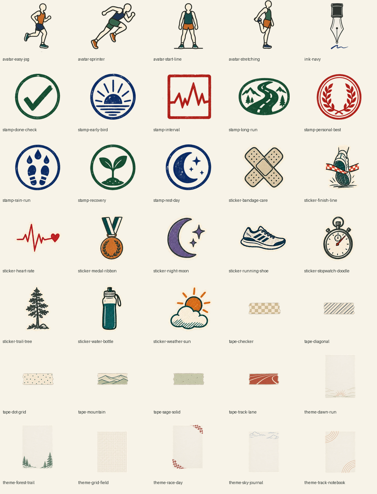

# 꾸미기 카탈로그 확장 검수

## 판정

`PASS_FOR_PR2`

PR #307의 개별 항목표를 실행 기준으로 삼아 기존 자산을 포함한 카탈로그와 배포 자산을 대조했다.

## 재계수

| 항목 | 결과 |
| --- | ---: |
| 그림 자산 | 34개 |
| 잉크 스와치 카탈로그 ID | 1개 |
| 이모지 제외 카탈로그 ID | 35개 |
| 신규 그림 자산 | 27개 |
| 무료 항목 | 16개 |
| 유료 항목 | 19개 |
| 이모지 스티커 | 기존 48개 유지 |

지시서 §3.1의 `8→34`, `신규 26`, `무료 22·유료 12` 요약은 §3.2의 개별 항목표 합계와 일치하지 않는다. 누락할 항목을 임의로 고르지 않고 가격과 무료 여부가 명시된 개별 35행을 구현했다. 마지막 문서 정리 PR에서 요약 수치를 이 실행 결과로 정정한다.

## 시각 검수

- 최종 앱 WebP 35개를 종이색 `#F7F3E8` 위에 다시 렌더했다.
- 첫 시트 검수에서 발견한 러닝화·가로수·물병 주변의 다른 항목 조각을 원본 재크롭으로 제거했다.
- 도장 8개는 문자 없이 단색 계열을 유지한다.
- 테마 6개는 본문을 가리지 않도록 가운데 기록 영역을 비웠다.
- 아바타 4개는 얼굴 이목구비를 넣지 않았다.

## 계약 검증

- 기존 8개 ID와 가격을 보존한다.
- 카테고리 수는 `THEME 6 / TAPE 6 / STICKER 10 / STAMP 8 / INK 1 / AVATAR 4`다.
- 무료 항목은 구버전 V3 상태를 읽을 때 자동으로 보유 목록에 보강된다.
- 유료 항목은 구매 전 저장·장착·배치할 수 없다.
- 35개 파일은 WebP 형식, 카테고리별 고정 크기, 파일당 120KB 이하를 만족한다.
- 이 단계는 편집기 서랍 UI를 변경하지 않는다.
