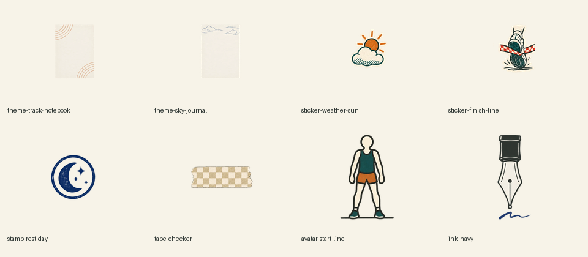

# 기존 꾸미기 자산 8종 톤 검수

## 판정

`PASS_FOR_PR1`

PR #307의 정체성인 "호보니치 테초 위에 MUJI 문구로 꾸민 러너의 훈련 일지"에 맞춰 기존 8종을 한 제작 계열로 다시 만들었다. 이 단계는 자산 교체만 수행하며 카탈로그, 스키마, 편집기 동작은 변경하지 않는다.

## 대상

| 구분 | 파일 | 확인 결과 |
| --- | --- | --- |
| 테마 | `theme-track-notebook.webp` | 넓은 기록 여백과 얇은 트랙 코너선 유지 |
| 테마 | `theme-sky-journal.webp` | 넓은 기록 여백과 상단 구름선 유지 |
| 스티커 | `sticker-weather-sun.webp` | 표정 없는 날씨 기호, 평면 인쇄 톤 |
| 스티커 | `sticker-finish-line.webp` | 러닝화와 결승 리본, 문자 없음 |
| 도장 | `stamp-rest-day.webp` | 남색 단색 휴식 기호, 문자 없음 |
| 테이프 | `tape-checker.webp` | 무광 종이 체크 패턴, 배경 그림자 제거 |
| 아바타 | `avatar-start-line.webp` | 얼굴·성별·체형 단서 없는 출발 아이콘 |
| 잉크 | `ink-navy.webp` | 남색 필기 도구 기호, 문자 없음 |

## 시각 증거

검수 이미지는 최종 WebP 파일을 다시 읽어 `#F7F3E8` 종이 배경 위에 동일한 크기로 배치했다. 생성 원본이 아니라 앱이 실제로 읽는 결과물을 비교한 증거다.

## 경계

- 앱·스키마·카탈로그·테스트 코드는 수정하지 않았다.
- 신규 26종과 재료 서랍 UI는 후속 PR에서 다룬다.
- 이미지에는 사용자 입력, 선수 데이터, 외부 상표, 문구가 포함되지 않는다.
- 실제 기기에서의 최종 크기와 상호작용 검수는 카탈로그 및 서랍 연결 후 수행한다.
