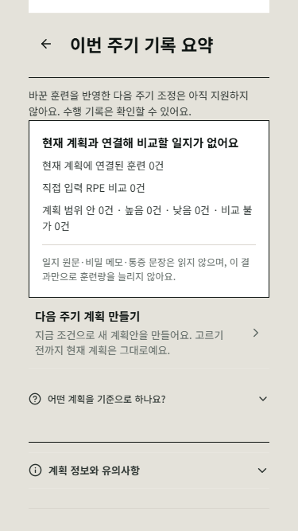
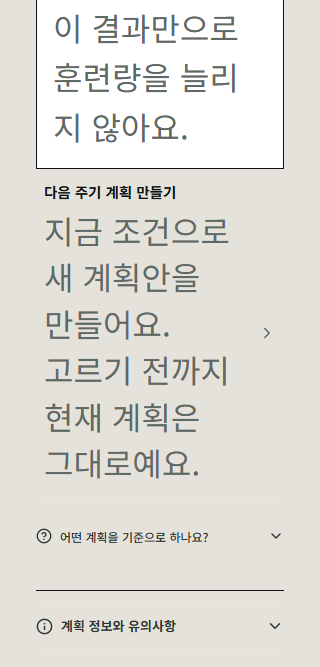

# 현재 주기 문맥과 다음 주기 진입 검증

status: LOCAL_VERIFIED_NOT_DEPLOYED
base_commit: 555117ae
candidate: base_commit 이후 같은 브랜치의 이 증거와 함께 커밋되는 변경
production_access: none
independent_review: GPT-6.1 Sol ultra, static only

## 검증 범위

현재 V3 처방과 검증된 같은 주기 원본 체인을 분리해 읽는다. 원본 A/B는 과거 근거이며
새 형제 후보나 수치 변환의 권한이 아니다. 수행 요약에서 기존 일반 다음 주기 준비로
진입하되 현재 계획은 확정 전까지 유지한다. 카탈로그 NEXT_FRAME 수치 변환은 미구현이다.

| 확인 | 실제 결과 | 증거 |
|---|---|---|
| 집중 회귀 7파일 | UTC 97/97, Asia/Seoul 97/97 | [UTC](final-utc.json), [KST](final-kst.json) |
| 원본 체인 검증 제거 | 지정 회귀 1개 실패 | [currentChain](context-mut-currentChain.json) |
| 계정 scope/revision 재조회 제거 | 지정 회귀 1개 실패 | [pendingScope](context-mut-pendingScope.json) |
| 진입 시 pending 재조회 제거 | 지정 회귀 1개 실패 | [pendingEntry](context-mut-pendingEntry.json) |
| 최종 선택 잠금의 pending 검사 제거 | 지정 회귀 1개 실패 | [pendingCommit](context-mut-pendingCommit.json) |
| COACH 진입 제한 제거 | 지정 회귀 1개 실패 | [coachEntry](context-mut-coachEntry.json) |
| 실제 PlanBeta 브라우저 | 합성 게스트 6/6 조합, 오류/외부 요청/가로 넘침 0 | [결과](browser-result.json) |
| 타입 검사 | exit 0 | Node 24, app tsc --noEmit |
| 서버 생성 검증기 원본 일치 | 3개 check:true | account-state, account-plan-collection, account-journal-record |
| 독립 정적 검수 | 최초 P2 3건, 수정 후 범위 한정 승인 | [최초](independent-initial.json), [재검수](independent-final.json) |

시간대 재실행을 194개 고유 사례로 합산하지 않는다. 이 작업은 기존 100개 페르소나
발견의 연결부 수리이며 새 100명 검수나 실제 사용자 시험이 아니다. 독립 검수자는
코드/테스트 소스를 읽었지만 이 폴더의 테스트와 브라우저를 직접 실행하지 않았다.

## 사용자 흐름과 장단점

- 원본 유무에 따라 설명을 구분하고 지금 처방은 보존한다. 원본 부족을 새 근거로 꾸미지 않는다.
- 요약에서 다음 계획을 바로 준비할 수 있다. 취소하면 현재 계획과 보관 이력이 그대로다.
- 다른 탭이 이미 다음 계획을 골랐다면 새 선택으로 덮지 않고 기존 확인 경로를 유지한다.
- COACH 전용 계획은 읽기 요약을 유지하되 SELF 전용 생성으로 유도하지 않는다.
- 상세 이유는 접힌 상태로 둔다. 작은 화면/큰 글자에서는 세로 스크롤이 여전히 필요하며,
  한 화면에 모두 들어온다거나 실제 iOS 글자 확대 검증을 마쳤다고 주장하지 않는다.
- 과거 수동 변경을 다음 주기에 자동 복사하지 않으므로 처방 정책을 넘지 않지만,
  상세 카탈로그를 실제 수행에 따라 수치 조정하는 후속 기능까지 완성된 것은 아니다.

브라우저는 320/375px 일반 글자와 320px 합성 200% 글자+reduced-motion 각각에서
원본 체인 있음/없음을 확인했다. 도움말 열기, 새 계획 준비, 취소, 재진입, 확정, 정확한
전임자 보관을 검사했다. 일지/계획은 합성이고 네트워크는 임시 루프백만 허용했다.





## 재현

저장소 루트에서 실행한다. 보존된 실행기는 원래 상대 경로를 사용하므로 아래 위치로
복사한 뒤 실행해야 한다. 기존 파일이 있다면 먼저 비교하며 타인의 작업을 덮어쓰지 않는다.

- `run.mjs` -> `.scratch/b06-cycle-lineage-20261001/run.mjs`
- `entry.tsx`, `browser.cjs` -> `.scratch/b06-current-context-20261001/`
- Node 24와 이미 설치된 app 의존성/Chrome을 사용한다. 환경 파일이나 운영 계정은 읽지 않는다.

```powershell
$tests = @(
  'src/domain/plan-current-cycle-context.contract.test.ts',
  'src/domain/plan-adaptation-ui.contract.test.ts',
  'src/domain/plan-cycle-lineage.contract.test.ts',
  'src/screens/plan-beta/plan-next-draft.contract.test.tsx',
  'src/screens/plan-beta/PlanAdaptationFlow.contract.test.tsx',
  'src/screens/plan-beta/plan-next-account.contract.test.tsx',
  'src/screens/plan-beta/plan-next-selection.contract.test.ts'
)
$env:TZ = 'UTC'
$env:B06_RUN = 'recheck-current-context-utc'
node .scratch/b06-cycle-lineage-20261001/run.mjs @tests
$env:TZ = 'Asia/Seoul'
$env:B06_RUN = 'recheck-current-context-kst'
node .scratch/b06-cycle-lineage-20261001/run.mjs @tests
node .scratch/b06-current-context-20261001/browser.cjs
```

결함 주입은 `B06_MUTATION`에 위 표의 키를 하나씩 넣고 `B06_TEST_NAME`으로 해당
JSON의 실패 이름을 선택한다. currentChain은 도메인 context 파일, 나머지는
PlanAdaptationFlow 계약 파일을 사용한다. 기대 exit 1뿐 아니라 지정된 단언 실패와
변조 대상 존재를 확인한다. `run.mjs`는 메모리 변환만 하며 제품 파일은 바꾸지 않는다.
재실행 결과는 새 이름으로 보존하고 이 폴더의 과거 결과를 덮어쓰지 않는다.

## 남은 경계

- W1: 최초 자동 상세 처방의 RPE/전체 시간 정책에 대한 오너 결정.
- B06: 카탈로그 다음 주기 수치 변환의 채택/구현. 현재 registry 거절 유지.
- 운영: DB 0041 -> 두 계정 서버 -> 앱 -> 공개 화면/승인된 운영 계정 확인.
- 실제 iOS, 최종 릴리스 전체 관문은 미실행. 이 집중 검사는 배포 승인 대신이 아니다.

[DRAFT_COMPLETE]
